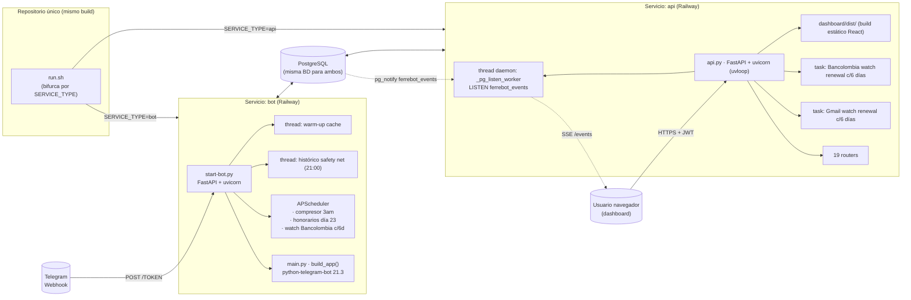
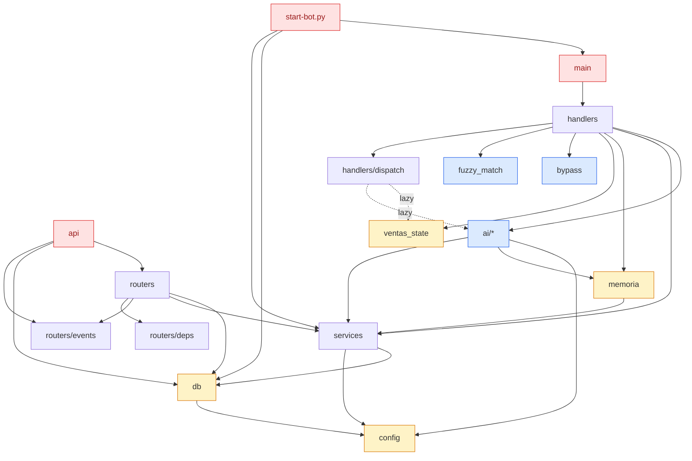
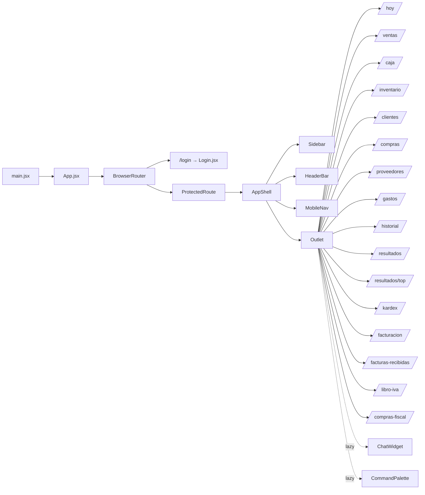

# 01 · Mapa estructural del proyecto

> Auditoría exhaustiva — Fase 1 de 8.
> Objetivo: dejar plasmada la estructura **real** del código (no la documentada) para que cualquier persona pueda navegar el repo y entender qué se despliega, dónde viven los entrypoints, qué se registra al arrancar y qué endpoints existen.

---

## 1. Vista de despliegue (Railway)

Un único repositorio sirve **dos servicios diferentes** en Railway según la variable `SERVICE_TYPE`. Ambos comparten build, dependencias y el mismo módulo `db.py`/`config.py`.



**Observaciones clave**:
- Bot y API **se conectan a la misma base de datos**. La capa de comunicación bot→dashboard es `pg_notify` sobre el canal `ferrebot_events`.
- El servicio API arranca el dashboard como **archivos estáticos servidos por FastAPI** desde `dashboard/dist/`. No hay servidor frontend independiente.
- Solo el servicio **api** ejecuta `_pg_listen_worker` y propaga eventos por SSE; el servicio **bot** solo emite vía `pg_notify` (no escucha).
- Ambos servicios cargan `metrics.py` con la etiqueta del servicio ("bot" o "api") para Prometheus.
- Sentry se inicializa en ambos si `SENTRY_DSN` está presente, con `FastApiIntegration` solo en el servicio api.

---

## 2. Entrypoints y orquestación

### `run.sh`
```bash
if [ "$SERVICE_TYPE" = "bot" ]; then python3 start-bot.py
else python3 -m uvicorn api:app --host 0.0.0.0 --port $PORT
fi
```
Sin `$SERVICE_TYPE` explícito, el comportamiento por defecto en Railway es servicio **api**.

### `start-bot.py` (servicio bot)
Responsabilidades en orden de ejecución:
1. Logging y validación de `WEBHOOK_URL`.
2. `db.init_db()` — pool PostgreSQL.
3. **Thread daemon**: warm-up de cache de catálogo.
4. **Thread daemon**: histórico safety net (revisa cada hora, persiste a 21:00 si no se cerró el día).
5. Construye índice fuzzy de productos al arranque.
6. `lifespan` async:
   - `build_app()` → Application PTB con todos los handlers.
   - `tg_app.initialize()` + `tg_app.start()`.
   - Registra label "bot" en `metrics`.
   - `bot.set_webhook(WEBHOOK_URL/TOKEN)`.
   - Lanza `loop_keepalive()` como task.
   - Arranca **APScheduler** con 3 jobs (ver §3).
   - Arranca task `_startup_watch` con 20s delay si `BANCOLOMBIA_PUBSUB_TOPIC` está set.
7. Endpoint `POST /{TELEGRAM_TOKEN}` recibe los updates y los procesa.
8. `GET /health` y `GET /metrics` (Prometheus).

### `start.py` (solo desarrollo local)
Corre bot + API juntos en un único proceso (no usado en producción).

### `api.py` (servicio api)
1. `load_dotenv()` al inicio del módulo (lectura inmediata de `.env`).
2. `logging.basicConfig` global aquí (no en `start-bot.py`).
3. Silencia loggers de terceros.
4. Inicializa **Sentry** con `FastApiIntegration` + `LoggingIntegration` si `SENTRY_DSN`.
5. Importa 19 routers.
6. `lifespan` async:
   - `db.init_db()`.
   - Registra label "api" en `metrics`.
   - `events.set_main_loop(asyncio.get_event_loop())`.
   - **Thread daemon** `_pg_listen_worker`: `LISTEN ferrebot_events` con `select.select` timeout 5s y reconexión cada 5s.
   - **Task** Gmail watch renewal cada 6 días.
   - **Task** Bancolombia Gmail watch renewal cada 6 días.
7. Middleware:
   - `RequestLoggingMiddleware` — request_id, timing, omite GET polling rápidos, **excluye `/events`** del log.
   - `CORSMiddleware` con `CORS_ORIGIN` (fallback **hardcoded** a URL de Punto Rojo).
8. Registra los 19 routers (orden: auth, usuarios, ventas, catalogo, caja, clientes, reportes, historico, chat, proveedores, facturacion, libro_iva, honorarios, gmail_webhook, bold_webhook, wompi_webhook, bancolombia_notifier, events).
9. Endpoints inline: `/api/health`, `/metrics` (con bearer opcional), `/webhooks/sentry` (reenvía alertas a Telegram), `OPTIONS /auth/telegram`.
10. `/auth/telegram` tiene un OPTIONS handler **manual** con headers CORS hardcoded — workaround del catch-all SPA.
11. Sirve `dashboard/dist/` con SPA fallback y blocklist hardcoded `("compras-fiscal", "libro-iva")` para que el catch-all no robe esas rutas.

---

## 3. Tareas programadas (APScheduler — solo en servicio bot)

| Job ID | Trigger | Función | Propósito |
|---|---|---|---|
| `compresor_nocturno` | CronTrigger hour=3 minute=0 (Bogotá) | `services.compresor_nocturno.compresor_nocturno_job` | Destila conversaciones del día en memoria de entidad |
| `honorarios_mensual` | CronTrigger day=23 hour=9 minute=0 (Bogotá) | `_job_honorarios` inline en `start-bot.py` | Genera Cuenta de Cobro CC, Documento Soporte DSNO en MATIAS, envía PDFs por Telegram |
| `watch_bancolombia` | IntervalTrigger days=6 | `_job_watch_bancolombia` inline | Renueva watch Gmail Bancolombia (expira a 7d), alerta Telegram si falla |

Además, **task asyncio** (no APScheduler): `_startup_watch` con 20s de delay si hay `BANCOLOMBIA_PUBSUB_TOPIC`.

En el servicio **api** hay **2 tasks asyncio adicionales** sin APScheduler:
- Renovación Gmail watch (compras): cada 6 días, delay 30s.
- Renovación Gmail watch Bancolombia: cada 6 días, delay 60s.

> ⚠️ La renovación de Bancolombia está duplicada: APScheduler en bot + asyncio task en api. Detalle a auditar en Fase 4.

---

## 4. Estructura de módulos Python

```
bot-ventas-ferreteria/
├── api.py                ← FastAPI entry (servicio "api")
├── start-bot.py          ← Bot entry (servicio "bot")
├── start.py              ← Dev local: bot + api en mismo proceso
├── main.py               ← build_app() PTB con todos los handlers
├── run.sh                ← bifurca SERVICE_TYPE
│
├── config.py             ← env vars, clients Anthropic/OpenAI, COLOMBIA_TZ
├── db.py                 ← Pool PG (minconn=2, maxconn=10), _init_schema inline SQL
├── memoria.py            ← thin wrapper → services/catalogo_service.py (~151 callers)
├── ventas_state.py       ← estado en memoria de ventas pendientes
├── utils.py              ← fracciones, formato monetario
├── bypass.py             ← bypass Python para ventas simples (~60% sin Claude)
├── fuzzy_match.py        ← búsqueda fuzzy de productos
├── alias_manager.py      ← aliases dinámicos
├── skill_loader.py       ← skills personalizados del bot
├── graficas.py           ← reportes gráficos
├── keepalive.py          ← ping anti-sleep
├── metrics.py            ← Prometheus exposition
├── import_clientes.py    ← script importación masiva clientes
├── generar_facturas.py   ← script CLI generación masiva facturas
├── generate_bancolombia_token.py ← script OAuth one-shot
│
├── ai/                   ← Procesamiento IA
│   ├── prompts.py        ← system prompt Claude (incluye _ALIAS_FERRETERIA)
│   ├── prompt_context.py ← contexto dinámico (caja abierta, fiados, …)
│   ├── prompt_products.py← serialización catálogo
│   ├── price_cache.py    ← caché precios TTL 300s
│   ├── response_builder.py
│   ├── excel_gen.py
│   ├── budget.py         ← presupuestos diarios Sonnet/Haiku
│   ├── memoria_turno.py
│   └── __init__.py       ← re-exporta procesar_con_claude
│
├── handlers/             ← Bot Telegram
│   ├── mensajes.py       ← handler principal (texto/audio/foto/documento)
│   ├── dispatch.py       ← flujos especiales (LAZY IMPORTS obligatorios)
│   ├── intent.py         ← clasificación intención
│   ├── parsing.py        ← parser respuestas estructuradas
│   ├── callbacks.py      ← botones inline
│   ├── cliente_flujo.py  ← wizard cliente
│   ├── alias_handler.py
│   ├── productos.py
│   ├── audio_sales.py
│   ├── comandos.py       ← /start, /help, comandos generales
│   ├── cmd_ventas.py
│   ├── cmd_caja.py
│   ├── cmd_inventario.py
│   ├── cmd_clientes.py
│   ├── cmd_admin.py
│   ├── cmd_auth.py
│   ├── cmd_facturacion.py
│   ├── cmd_proveedores.py
│   └── cmd_honorarios.py
│
├── middleware/           ← Bot
│   └── auth.py           ← @protegido (auth + rate limit threading.Lock)
│
├── auth/                 ← Bot
│   └── usuarios.py       ← get_usuario, is_admin, registrar_telegram_id
│
├── routers/              ← API FastAPI (19 archivos · ~80 endpoints)
│   ├── deps.py
│   ├── shared.py
│   ├── auth.py
│   ├── usuarios.py
│   ├── ventas.py
│   ├── catalogo.py
│   ├── caja.py
│   ├── clientes.py
│   ├── reportes.py
│   ├── historico.py
│   ├── chat.py
│   ├── proveedores.py
│   ├── facturacion.py
│   ├── libro_iva.py
│   ├── honorarios.py
│   ├── gmail_webhook.py
│   ├── bold_webhook.py
│   ├── wompi_webhook.py
│   ├── bancolombia_notifier.py
│   └── events.py
│
├── services/             ← Lógica de negocio reutilizable
│   ├── catalogo_service.py          (fuente de verdad de memoria.py)
│   ├── caja_service.py
│   ├── inventario_service.py
│   ├── fiados_service.py
│   ├── facturacion_service.py       ← MATIAS API
│   ├── documento_soporte_service.py ← DSNO
│   ├── honorarios_service.py        ← Cuentas de Cobro
│   ├── eventos_dian_service.py
│   ├── memoria_entidad_service.py
│   ├── compresor_nocturno.py        ← APScheduler job 3am
│   └── search_service.py
│
├── migrations/           ← 30 migraciones (ver §7)
├── tests/                ← 24 archivos pytest
├── test_suite.py         ← runner manual
│
└── dashboard/            ← Frontend React + Vite
    └── src/
        ├── App.jsx
        ├── main.jsx
        ├── routes.jsx
        ├── pages/Login.jsx
        ├── components/{AppShell, HeaderBar, Sidebar, MobileNav,
        │             ProtectedRoute, ChatWidget, CommandPalette,
        │             ReporteFinanciero, KpiCard, shared, ui/*}
        ├── hooks/useVendorFilter.jsx
        └── tabs/{TabHoy, TabVentasRapidas, TabCaja, TabInventario,
                  TabClientes, TabCompras, TabComprasFiscal, TabProveedores,
                  TabGastos, TabHistorial, TabResultados, TabTopProductos,
                  TabKardex, TabFacturacion, TabLibroIVA,
                  FacturasElectronicasRecibidas, historial/{VistaDia, VistaMes}}
```

---

## 5. Grafo de dependencias entre módulos (vista lógica)



**Hechos del grafo**:
- `db` y `config` están en la base del DAG — no importan a nadie del proyecto.
- `services/` es la capa de lógica que tanto bot (handlers) como API (routers) consumen.
- `memoria.py` es un thin wrapper que re-exporta desde `catalogo_service.py` — declarado en CLAUDE.md.
- `handlers/dispatch.py` y `handlers/callbacks.py` tienen **todos los imports lazy** dentro de funciones para evitar ciclos con `ventas_state` y `mensajes`.
- `events.py` es importado tanto por `api.py` (para `set_main_loop`) como por la mayoría de los routers (para `notify_all`).

---

## 6. Endpoints HTTP — inventario completo

> Extraído por grep `^@router\.(get|post|put|patch|delete|options)\(` en `routers/`.

### Auth (2)
| Método | Ruta | Notas |
|---|---|---|
| POST | `/auth/telegram` | Telegram Login Widget → JWT. Tiene OPTIONS handler manual en `api.py`. |
| GET  | `/auth/me` | Datos del usuario autenticado. |

### Usuarios (1)
| Método | Ruta | Notas |
|---|---|---|
| GET | `/usuarios/vendedores` | Solo prefix `/usuarios` declarado en `APIRouter()`. |

### Ventas (10)
`/ventas/hoy`, `/ventas/semana`, `/ventas/top`, `/ventas/top2`, `/ventas/resumen`, `POST /venta-rapida`, `POST /ventas/varia`, `DELETE /ventas/{numero}`, `DELETE /ventas/{numero}/linea`, `PATCH /ventas/{numero}`, `GET /export/ventas.xlsx`.

### Catálogo + Inventario (15)
`/productos`, `/productos/frecuentes`, `/inventario/bajo`, `/catalogo/nav`, `/kardex` (también en reportes), `POST /catalogo`, `PATCH /catalogo/{key:path}/precio`, `PATCH /catalogo/{key:path}/fracciones`, `PATCH /catalogo/{key:path}/mayorista`, `PATCH /inventario/{key:path}/stock`, `PATCH /catalogo/{key:path}`, `DELETE /catalogo/{key:path}`, `POST /catalogo/sync-desde-excel`, `POST /catalogo/agregar-a-excel`, `POST /catalogo/{key:path}/agregar-a-excel`.

### Clientes (6)
`/clientes/buscar`, `POST /clientes`, `GET /clientes`, `/clientes/paises`, `/clientes/ciudades`, `PATCH /clientes/{cliente_id}`, `DELETE /clientes/{cliente_id}`.

### Caja, gastos, compras, compras-fiscal (14)
`/caja`, `POST /caja/abrir`, `POST /caja/cerrar`, `POST /gastos`, `GET /gastos`, `POST /compras`, `GET /compras`, `PUT /compras/{compra_id}`, `POST /compras/{compra_id}/to-fiscal`, `GET /compras-fiscal`, `POST /compras-fiscal`, `PUT /compras-fiscal/{fiscal_id}`, `POST /compras-fiscal/{fiscal_id}/to-compras`, `POST /compras-fiscal/bulk-to-compras`.

### Histórico (7)
`GET/POST /historico/ventas`, `/historico/resumen`, `/historico/diario`, `POST /historico/auto-sync`, `POST /historico/corregir-dia`, `POST /historico/reconstruir-desglose`, `POST /historico/sync-rango`.

### Reportes (3)
`/kardex`, `/resultados`, `/proyeccion`.

### Chat (IA del dashboard) (7)
`POST /chat`, `POST /chat/stream`, `POST /chat/memoria`, `GET /chat/export/{token}`, `/chat/briefing`, `/chat/reporte-datos`, `POST /chat/transcribir`.

### Proveedores (10)
`/proveedores/compras-sin-factura`, `/proveedores/facturas` (GET y POST), `POST /proveedores/facturas/{fac_id}/foto`, `POST /proveedores/abonos`, `POST /proveedores/abonos/{fac_id}/foto`, `/proveedores/facturas-electronicas`, `POST /proveedores/aceptar`, `POST /proveedores/reclamar`, `POST /proveedores/reintentar-030`, `/proveedores/resumen`.

### Facturación electrónica DIAN (MATIAS) (12)
`POST /facturacion/emitir`, `/facturacion/ventas-pendientes`, `/facturacion/lista`, `/facturacion/pdf/{cufe}`, `/facturacion/estado/{numero}`, `/facturacion/ultimo-numero`, `/facturacion/validar-cliente`, `POST /facturacion/reenviar-correo/{cufe}`, `POST /facturacion/nota-credito`, `POST /facturacion/nota-debito`, `/facturacion/notas`, `POST /facturacion/webhook`.

### Libro IVA (6)
`/libro-iva/periodos`, `/libro-iva/resumen`, `/libro-iva/ventas`, `/libro-iva/compras`, `POST /libro-iva/cerrar-bimestre`, `/libro-iva/historial-cierres`.

### Honorarios (3)
`/honorarios/lista`, `/honorarios/pdf/{consecutivo}`, `POST /honorarios/generar`.

### Webhooks externos (8)
- Gmail compras: `POST /gmail/webhook`, `POST /gmail/webhook/watch`, `/gmail/webhook/status`, `POST /gmail/token`.
- Bold: `POST /bold/webhook`.
- Wompi: `POST /wompi/webhook`.
- Bancolombia: `POST /bancolombia/gmail/webhook`, `POST /bancolombia/gmail/watch`, `/bancolombia/transferencias/status`, `POST /bancolombia/gmail/token`, `/bancolombia/transferencias`.

### SSE (2)
`GET /events`, `GET /events/status`.

### Inline en `api.py` (4)
`/api/health`, `/metrics`, `POST /webhooks/sentry`, `OPTIONS /auth/telegram`, más SPA catch-all `/{full_path:path}`.

**Total ~95 rutas HTTP**.

---

## 6.b. Inconsistencias detectadas (resumen — detalle en Fase 4)

1. `routers/usuarios.py` es el **único router con prefix declarado** (`/usuarios`). Los demás declaran las rutas con prefijos *en cada decorator*, lo que genera inconsistencias visuales (`/honorarios/lista` vs prefix vacío) y dificulta refactorizar.
2. `routers/reportes.py` y `routers/catalogo.py` **ambos definen `GET /kardex`**. El orden de registro en `api.py` determina cuál gana: `reportes` se registra antes que `catalogo`, así que la versión de catálogo nunca se sirve. Posible dead code.
3. `chat.py` registra **3 endpoints sin prefijo dedicado** (`/chat`, `/chat/stream`, `/chat/memoria`, `/chat/briefing`, etc.). El SPA catch-all en `api.py` filtra `compras-fiscal` y `libro-iva` manualmente; cualquier nuevo prefijo con guión queda expuesto al mismo bug.
4. `wompi_webhook` se importa y registra en `api.py` pero **no aparece en el docstring del propio archivo** (`api.py:9-18`).

---

## 7. Migraciones — qué creó cada una

> Numeración duplicada en varios casos. Las migraciones se ejecutan manualmente; **no hay tabla `schema_migrations`** ni control de versiones automático. Algunas tablas también se crean en `db._init_schema()` (doble fuente de verdad).

| # | Archivo | Tabla / cambio |
|---|---|---|
| 001 | `001_migrate_memoria.py` | `productos`, `productos_fracciones` (migra desde `memoria.json`) |
| 002 | `002_migrate_historico.py` | `historico_ventas` (desde `historico_ventas.json`) |
| 003 | `003_migrate_ventas.py` | `ventas`, `ventas_detalle` |
| 004 | `004_migrate_gastos_caja.py` | `gastos`, `caja` |
| 004 | `004_usuarios_auth.py` | `usuarios` (RBAC) — **comparte número con la anterior** |
| 005 | `005_migrate_compras.py` | `compras` |
| 006 | `006_migrate_fiados.py` | `fiados` |
| 007 | `007_migrate_proveedores.py` | `facturas_proveedores`, `facturas_abonos` |
| 008 | `008_migrate_facturacion.py` | tablas DIAN — facturación electrónica |
| 009 | `009_iva_compras_saldos.py` | IVA en compras, columnas saldos |
| 010 | `010_compras_fiscal.py` | `compras_fiscal` |
| 011 | `011_add_admin_nuevo_cel.py` | dato puntual: admin con celular nuevo |
| 011 | `011_clientes_campos_fe.py` | columnas FE en `clientes` — **comparte número** |
| 011 | `011_gmail_compras.py` | tabla gmail_compras — **comparte número** |
| 012 | `012_ferrebot_config.py` | tabla `ferrebot_config` |
| 012 | `012_fix_regimen_fiscal.py` | corrección dato — **comparte número** |
| 013 | `013_notas_electronicas.py` | notas crédito/débito |
| 013 | `013_productos_iva_19.py` | iva=19 en productos — **comparte número** |
| 014 | `014_iva_productos.py` | iva por producto |
| 015 | `015_eventos_dian.py` | `eventos_dian` |
| 016 | `016_audio_logs.py` | `audio_logs` |
| 016 | `016_bancolombia_transferencias.py` | bancolombia — **comparte número** |
| 017 | `017_budget_tracking.py` | presupuestos Claude |
| 018 | `018_conversaciones_bot.py` | `conversaciones_bot` |
| 019 | `019_fts_search.py` | índices full-text search |
| 020 | `020_memoria_entidades.py` | memoria entidades |
| 021 | `021_honorarios.py` | `cuentas_cobro` |
| 022 | `022_documento_soporte.py` | `documentos_soporte` |
| 023 | `023_insertar_ds5_manual.py` | dato puntual: DS5 manual |

> **6 colisiones de numeración** (004, 011, 012, 013, 016). El número de fila no determina orden — hay que conocer el contenido. Detalle en Fase 4.

---

## 8. Dashboard React — rutas y composición



**Resumen**:
- 16 tabs activos + 2 redirects de compatibilidad (`/resumen → /hoy`, `/historico → /historial?view=mes`).
- Todos los tabs cargan con `React.lazy()` — code-splitting por ruta.
- `AppShell` envuelve todo lo autenticado; `ProtectedRoute` revisa el JWT en `localStorage` antes de montar el shell.
- `useOutletContext` propaga un `refreshKey` que cada tab recibe como prop.
- `ErrorBoundary` clase en el nivel raíz captura errores no manejados de chunks lazy.
- shadcn/ui en `components/ui/` (button, card, dialog, dropdown-menu, input, label, select, table, tabs, tooltip, command, avatar, badge, sonner).

---

## 9. Variables de entorno — inventario y dónde se leen

| Variable | Servicio | Obligatoria | Leída en |
|---|---|:-:|---|
| `TELEGRAM_TOKEN` | bot + api | ✅ | `config.py`, `api.py` (sentry webhook), `routers/auth.py` (verifica firma Telegram Login), `bold_webhook`, `wompi_webhook`, `bancolombia_notifier`, `facturacion_service`, `start-bot` |
| `ANTHROPIC_API_KEY` | bot + api | ✅ | `config.py` (claude_client) |
| `OPENAI_API_KEY` | bot + api | ✅ | `config.py` (openai_client) |
| `DATABASE_URL` | bot + api | ✅ | `db.py`, `api.py` (pg listener), migrations, `import_clientes.py` |
| `WEBHOOK_URL` | bot | ✅ | `config.py`, `start-bot.py` (sale con exit 1 si falta) |
| `PORT` | ambos | inyectado por Railway | `config.WEBHOOK_PORT` |
| `SERVICE_TYPE` | ambos | ✅ | `run.sh` (bifurca) |
| `SECRET_KEY` | api | ✅ JWT | `routers/auth.py`, `routers/deps.py`, `routers/events.py` |
| `CORS_ORIGIN` | api | recomendado | `api.py` (fallback hardcoded a URL Punto Rojo) |
| `SENTRY_DSN` | ambos | opcional | `api.py`, `main.py` |
| `SENTRY_ALERT_CHAT_ID` | api | opcional | `api.py` (webhook Sentry → Telegram) |
| `METRICS_BEARER_TOKEN` | ambos | opcional | `metrics.py` |
| `MEMORIA_FILE` | ambos | opcional | `config.py` y varias migraciones (legacy memoria.json) |
| `HONORARIOS_VALOR` | bot | opcional (default 2 000 000) | `config.py` |
| `HONORARIOS_CHAT_ID` | bot | opcional | `config.py`, `start-bot.py` (_job_honorarios) |
| `MATIAS_EMAIL` | api | ✅ (FE) | `services/facturacion_service.py` |
| `MATIAS_PASSWORD` | api | ✅ (FE) | `services/facturacion_service.py` |
| `MATIAS_API_URL` | api | opcional | `services/facturacion_service.py` (default api-v2.matias-api.com) |
| `MATIAS_RESOLUTION` | api | ✅ | `services/facturacion_service.py` |
| `MATIAS_PREFIX` | api | ✅ | `services/facturacion_service.py` (default `FPR`) |
| `MATIAS_NUM_DESDE` | api | opcional | `services/facturacion_service.py` (default 1) |
| `MATIAS_RESOLUTION_DSNO` | bot + api | ✅ DSNO | `services/documento_soporte_service.py` |
| `MATIAS_DS_NUM_DESDE` | bot + api | opcional | `services/documento_soporte_service.py` |
| `MATIAS_AMBIENTE` | api | opcional | `services/documento_soporte_service.py` (default produccion) |
| `MATIAS_WEBHOOK_SECRET` | api | ✅ (webhook DIAN) | `routers/facturacion.py` |
| `CLOUDINARY_CLOUD_NAME` / `CLOUDINARY_API_KEY` / `CLOUDINARY_API_SECRET` | bot + api | para proveedores | `routers/proveedores.py`, `handlers/cmd_proveedores.py` |
| `AUTHORIZED_CHAT_IDS` | bot | recomendado | `middleware/auth.py` (fail-open si vacío), `services/honorarios_service.py`, `start-bot.py` |
| `RATE_LIMIT_SEGUNDOS` / `RATE_LIMIT_MAX` | bot | opcional | `middleware/auth.py` |
| `CARRITO_TIMEOUT_SEG` | bot | opcional | `ventas_state.py` (default 90) |
| `BUDGET_SONNET_DIARIO` / `BUDGET_HAIKU_DIARIO` | bot | opcional | `ai/budget.py` |
| `MODO_MATCH_ONLY` | bot | opcional | `ai/prompts.py` (toggle bypass-only) |
| `GMAIL_CLIENT_ID` / `GMAIL_CLIENT_SECRET` / `GMAIL_REFRESH_TOKEN` / `GMAIL_PUBSUB_TOPIC` / `GMAIL_USER` / `PUBSUB_TOKEN` | api | Gmail compras | `routers/gmail_webhook.py`, `api.py` |
| `BANCOLOMBIA_GMAIL_CLIENT_ID` / `BANCOLOMBIA_GMAIL_CLIENT_SECRET` / `BANCOLOMBIA_GMAIL_REFRESH_TOKEN` / `BANCOLOMBIA_PUBSUB_TOPIC` / `BANCOLOMBIA_GMAIL_USER` / `BANCOLOMBIA_PUBSUB_TOKEN` | api + bot | Bancolombia | `routers/bancolombia_notifier.py`, `start-bot.py`, `api.py` |
| `BOLD_WEBHOOK_SECRET` | api | webhook Bold | `routers/bold_webhook.py` |
| `WOMPI_EVENTS_SECRET` | api | webhook Wompi | `routers/wompi_webhook.py` |
| `TELEGRAM_NOTIFY_CHAT_ID` | api + bot | notificaciones | múltiples |
| `FIRMAS_PATH` | bot | opcional (default `assets/firmas`) | `services/honorarios_service.py` |
| `HISTORICO_FILE` | migración | opcional | `migrations/002_migrate_historico.py` |

> ⚠️ **53 variables de entorno** identificadas. Es el aspecto más explícito de "configuración por ferretería" hoy. Catalogo completo para reuso/seed en Fase 6-7.

---

## 10. Stack — versiones y dependencias clave

Detectadas por imports (no inspeccioné `requirements.txt` aún — pendiente Fase 4):

| Capa | Librería |
|---|---|
| Bot | `python-telegram-bot==21.3` (webhook FastAPI) |
| HTTP | FastAPI + Uvicorn |
| DB | psycopg2 + ThreadedConnectionPool, `RealDictCursor` por default |
| Realtime | SSE manual + `pg_notify`/`LISTEN` |
| Auth | `pyjwt` (HS256) |
| IA | `anthropic` (cache control + extended TTL), `openai` (Whisper) |
| Imágenes | `cloudinary` (proveedores) |
| Excel | (probable openpyxl/pandas — verificar) |
| Scheduler | APScheduler (`AsyncIOScheduler`) |
| Métricas | `prometheus_client` (vía `metrics.py`) |
| Errores | `sentry_sdk` |
| Frontend | React 18, Vite, react-router-dom, shadcn/ui, Tailwind, lucide-react |
| Build | Nixpacks (Railway): Node 20 + Python 3.11 |

---

## 11. Conclusión de Fase 1

**Tamaño**: ~74 k LOC, **2 servicios**, **19 routers**, **~95 endpoints HTTP**, **~60 comandos Telegram**, **16 tabs** dashboard, **30 migraciones**, **24 archivos de test**, **53+ variables de entorno**.

**Forma del sistema**: monolito modularizado con dos entrypoints que comparten lógica (`services/`) y datos (Postgres + pg_notify). El acoplamiento más fuerte está en `db.py` y `services/` — todo lo demás (routers, handlers) consume servicios. La capa `memoria.py` actúa como fachada de compatibilidad.

**Hallazgos preliminares ya visibles** (se desarrollan en Fase 4):
1. **RBAC efectivamente desactivado** en `routers/deps.py:60-79`: `get_filtro_usuario` siempre retorna `None`. Los routers que lo usan **no filtran por vendedor**. Contradice lo afirmado en `CLAUDE.md §RBAC`.
2. **Doble registro de `GET /kardex`** entre `routers/reportes.py` y `routers/catalogo.py`.
3. **Renovación duplicada del watch Bancolombia**: APScheduler en bot + asyncio task en api.
4. **Numeración duplicada en migraciones** (6 colisiones).
5. **`db._init_schema()` y migraciones se solapan** — dos fuentes de verdad sobre el esquema.
6. **CORS fallback hardcoded** a la URL pública de Punto Rojo en `api.py:323` y `api.py:452`.
7. **Token Telegram en URL path** (`/{TELEGRAM_TOKEN}`) — práctica común pero el token aparece en cualquier log HTTP.
8. **Catch-all SPA con blocklist hardcoded** (`compras-fiscal`, `libro-iva`) que necesita actualización manual para cada nuevo prefijo API con guión.
9. **`wompi_webhook` registrado pero no documentado** en el docstring de `api.py`.
10. **CLAUDE.md drift** vs el código real (más detalles en Fase 4).

**Próximos pasos**: Fase 2 — entrar al modelo de datos con diagrama ER por dominio.
