# 02 · Modelo de datos PostgreSQL

> Auditoría exhaustiva — Fase 2 de 8.
> Objetivo: documentar las **26 tablas** reales del sistema, sus FKs, sus índices, sus columnas críticas y los problemas detectados de integridad y diseño.

---

## 1. Resumen

| # | Tabla | Filas estimadas | Propósito | Dominio |
|---|---|---|---|---|
| 1 | `productos` | catálogo (cientos) | maestro productos | Catálogo |
| 2 | `productos_fracciones` | x productos | precio por fracción (1/4, 1/2…) | Catálogo |
| 3 | `inventario` | 1:1 productos | stock + costos promedio | Inventario |
| 4 | `clientes` | cientos | clientes con campos DIAN | CRM |
| 5 | `usuarios` | unidades | autenticación + RBAC | Auth |
| 6 | `ventas` | grande | encabezado venta | Ventas |
| 7 | `ventas_detalle` | muy grande | líneas de venta | Ventas |
| 8 | `historico_ventas` | un día por fila | totales por día | Reportes |
| 9 | `gastos` | mediana | egresos operativos | Caja |
| 10 | `caja` | un día por fila | apertura/cierre caja | Caja |
| 11 | `compras` | mediana | compras operativas (almacén) | Inventario |
| 12 | `compras_fiscal` | mediana | compras contables (libro IVA + DIAN) | Fiscal |
| 13 | `facturas_proveedores` | mediana | cuentas por pagar | Proveedores |
| 14 | `facturas_abonos` | mediana | abonos a facturas | Proveedores |
| 15 | `fiados` | unidades | crédito a clientes | Cartera |
| 16 | `facturas_electronicas` | grande | log emisión FE/notas DIAN | DIAN |
| 17 | `iva_saldos_bimestrales` | 6 por año | declaración IVA | DIAN |
| 18 | `cuentas_cobro` | mensual | CC honorarios | Honorarios |
| 19 | `documentos_soporte` | mensual | DSNO honorarios DIAN | Honorarios |
| 20 | `bancolombia_transferencias` | grande | transferencias bancarias | Pagos |
| 21 | `config` | unidades | config sistema clave/valor | Infra |
| 22 | `ferrebot_config` | unidades | config sistema (Gmail historyId, etc.) | Infra |
| 23 | `audio_logs` | mediana | transcripciones Whisper | IA |
| 24 | `conversaciones_bot` | grande | turnos chat persistidos | IA |
| 25 | `memoria_entidades` | mediana | notas estructuradas por producto/alias/vendedor | IA |
| 26 | `api_costo_diario` | mediana | costos Claude por vendedor/día | IA |

> ⚠️ **`config` y `ferrebot_config` son dos tablas distintas con el mismo propósito** (config clave/valor). `config` se crea en `db._init_schema()`, `ferrebot_config` en migración 012. Detalle en §9.

---

## 2. Vista global — agrupada por dominio

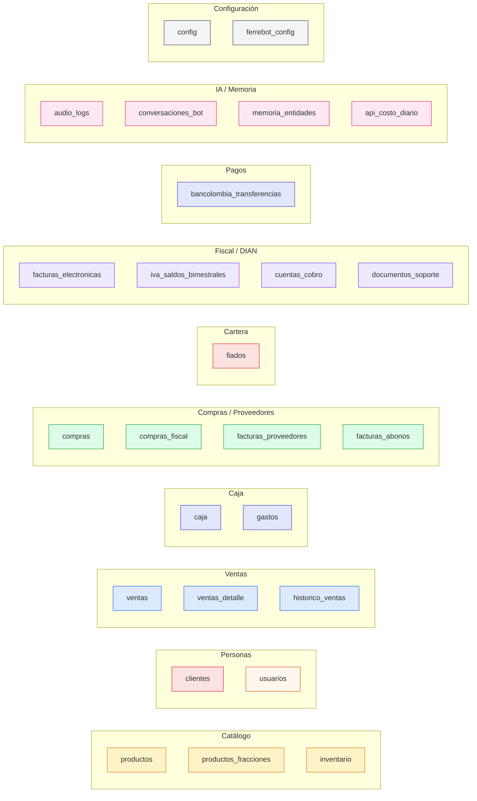

---

## 3. Diagrama ER por dominio

### 3.1. Catálogo + Inventario

```mermaid
erDiagram
    productos ||--o{ productos_fracciones : "tiene precios"
    productos ||--|| inventario : "1:1 stock"
    productos ||--o{ ventas_detalle : "vendido en"
    productos ||--o{ compras : "comprado en"
    productos ||--o{ compras_fiscal : "comprado fiscalmente"

    productos {
        SERIAL id PK
        VARCHAR(200) clave UK
        VARCHAR(300) nombre
        VARCHAR(300) nombre_lower
        VARCHAR(100) codigo
        VARCHAR(200) categoria
        INTEGER precio_unidad
        VARCHAR(50) unidad_medida
        TEXT[] aliases
        INTEGER precio_umbral
        INTEGER precio_bajo_umbral
        INTEGER precio_sobre_umbral
        BOOLEAN activo
        BOOLEAN tiene_iva
        INTEGER porcentaje_iva
        TIMESTAMP created_at
        TIMESTAMP updated_at
    }

    productos_fracciones {
        SERIAL id PK
        INTEGER producto_id FK
        VARCHAR(10) fraccion
        INTEGER precio_total
        INTEGER precio_unitario
    }

    inventario {
        SERIAL id PK
        INTEGER producto_id FK_UK
        NUMERIC cantidad
        NUMERIC minimo
        VARCHAR(50) unidad
        VARCHAR(300) nombre_original
        NUMERIC costo_promedio
        NUMERIC ultimo_costo
        VARCHAR(200) ultimo_proveedor
        TIMESTAMP ultima_compra
        TIMESTAMP ultima_venta
        TIMESTAMP ultimo_ajuste
        TIMESTAMP fecha_conteo
        TIMESTAMP updated_at
    }
```

**Hechos**:
- `productos.precio_umbral` + `precio_bajo_umbral` + `precio_sobre_umbral` implementan precio mayorista por cantidad — sin tabla auxiliar.
- `productos.aliases TEXT[]` con índice GIN — para typos y sinónimos.
- `inventario` tiene PK propia *y* `producto_id UNIQUE`, así que es 1:1 con productos.
- `productos_fracciones` tiene `UNIQUE(producto_id, fraccion)`.
- Sin FK desde `inventario.ultimo_proveedor` a una tabla `proveedores` — string libre.

### 3.2. Personas: clientes + usuarios

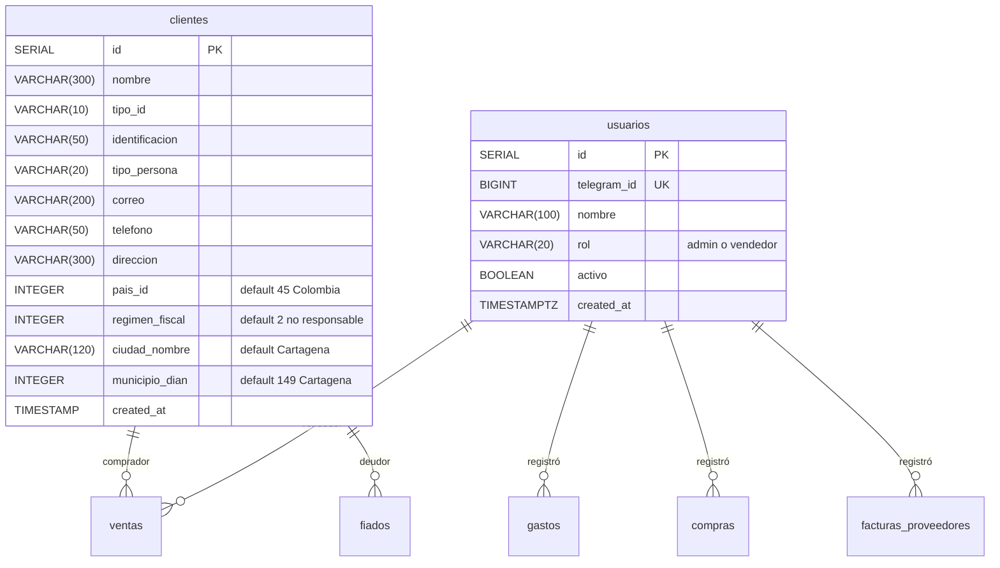

**Hechos**:
- `usuarios.telegram_id` se usa como identidad. Los seeds 1,2,3,4 son placeholders hasta que el vendedor real se "asocie" con `registrar_telegram_id()`.
- `clientes.regimen_fiscal` es **INTEGER** (1=Responsable IVA, 2=No Responsable) — pero migración 008 había añadido `regimen_fiscal VARCHAR(30) DEFAULT 'no_responsable_iva'`. Migración 011_clientes_campos_fe y 012_fix_regimen_fiscal cambian el tipo. Posible doble definición (Fase 4).
- `clientes` tiene **2 columnas de ciudad**: `ciudad_nombre` (string display) y `municipio_dian` (entero DANE/MATIAS). No hay relación entre ambas en la tabla — es responsabilidad de la app mantenerlas coherentes.
- `clientes.pais_id` = ID MATIAS (no ISO 3166).

### 3.3. Ventas

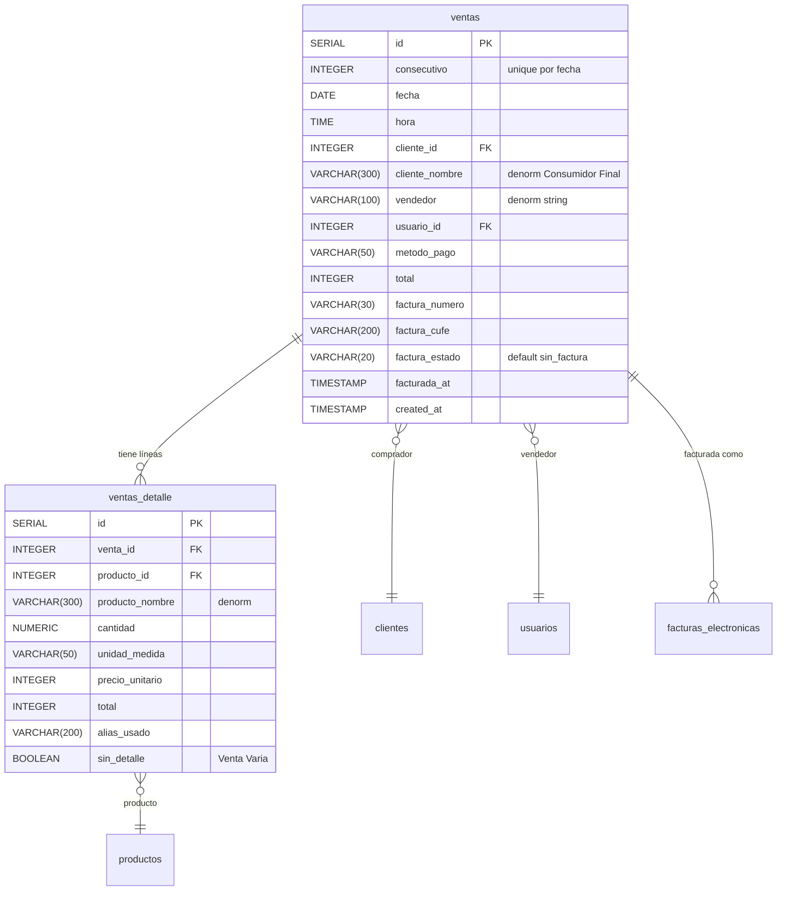

**Hechos**:
- `ventas` tiene **3 referencias al vendedor**: `vendedor` (string), `usuario_id` (FK). Una fila puede tener `usuario_id=NULL` y `vendedor='Andrés'` o viceversa — sin invariante que garantice consistencia.
- `consecutivo` único por fecha pero NO es PK; usa `id SERIAL` como PK y `UNIQUE(consecutivo, fecha)`. Esto permite "huecos" cuando se borra una venta.
- `sin_detalle=TRUE` marca "Venta Varia" (ajuste de caja sin producto real).
- Índices: `idx_ventas_fecha`, `idx_ventas_consecutivo`, `idx_ventas_detalle_venta`, `idx_ventas_usuario_id`, `ventas_detalle_producto_fts_idx` (GIN FTS español), `ventas_detalle_producto_trgm_idx` (GIN trigram fuzzy).
- **Falta índice** en `ventas.cliente_id` (consultas de "historial de un cliente" hacen full scan).

### 3.4. Caja + Histórico + Gastos

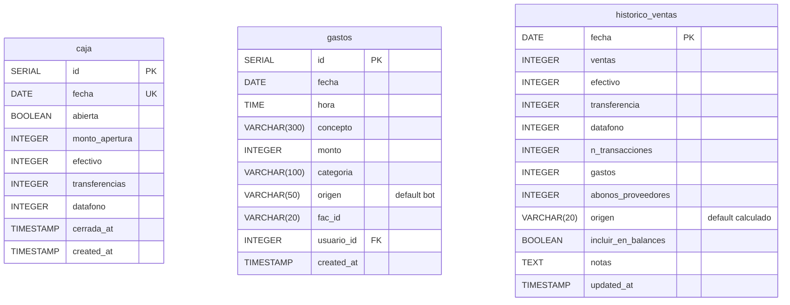

**Hechos**:
- `caja.fecha UNIQUE`: sólo una fila por día.
- `gastos.fac_id` referencia (no FK formal) a `facturas_proveedores.id` cuando el gasto es por una factura → posible FK explícita faltante.
- `historico_ventas` no tiene FK a `ventas`; es snapshot calculado al cerrar el día. El `historico-safety` thread (start-bot.py) lo persiste a 21:00 si no se hizo manualmente.
- Inconsistencia: `caja` y `historico_ventas` ambos guardan totales del día (efectivo/transferencias/datafono). `caja` es estado mientras el día está abierto, `historico_ventas` es el snapshot final. Hay que sincronizarlos manualmente (`/historico/auto-sync`, `/historico/corregir-dia`, `/historico/reconstruir-desglose`).

### 3.5. Compras (operativa + fiscal)

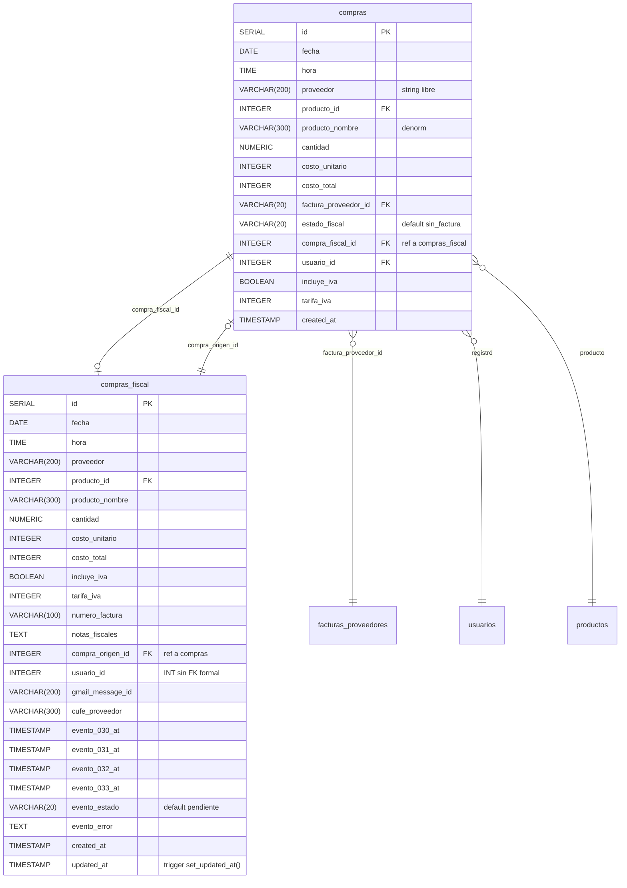

**Hechos**:
- **Relación bidireccional** entre `compras ↔ compras_fiscal`: `compras.compra_fiscal_id` apunta a `compras_fiscal.id`, y `compras_fiscal.compra_origen_id` apunta a `compras.id`. No hay constraint que impida divergencia (uno apunta al otro pero el otro a un tercero).
- `compras_fiscal.usuario_id INTEGER` (migración 010) — **sin REFERENCES usuarios(id)** (la 004_usuarios_auth no agrega FK a compras_fiscal porque la tabla aún no existía).
- **Eventos RADIAN/DIAN**: la tabla guarda timestamps de los 4 eventos (030/031/032/033) directamente como columnas, no en una tabla de log normalizada. Bueno para queries simples, malo si crece el set de eventos.
- Trigger `set_updated_at()` definido en migración 010 — única tabla con trigger en todo el schema.
- Índices: por fecha, por iva (parcial), por origen (parcial), por cufe (parcial), por evento_estado, por gmail_message_id (parcial UNIQUE).

### 3.6. Proveedores

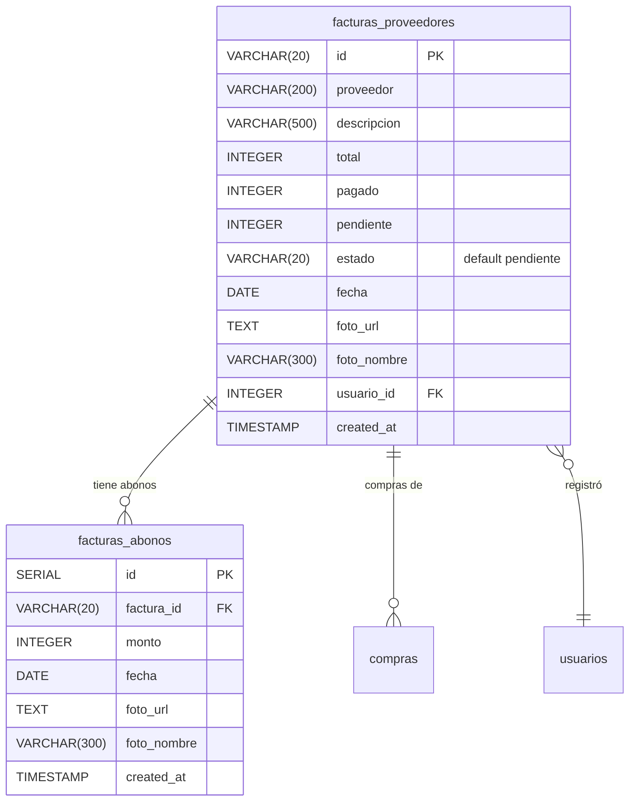

**Hechos**:
- `facturas_proveedores.id VARCHAR(20)` — PK alfanumérica generada por la app (no SERIAL). Permite IDs tipo `FAC-001`.
- `pagado + pendiente = total` es invariante que la app mantiene; **no hay CHECK constraint**.
- `foto_url` apunta a Cloudinary.

### 3.7. Cartera (fiados)

```mermaid
erDiagram
    fiados }o--|| clientes : "cliente_id UNIQUE"

    fiados {
        SERIAL id PK
        INTEGER cliente_id FK_UK
        VARCHAR(300) nombre
        INTEGER saldo_actual
        TIMESTAMP ultima_actualizacion
        TEXT notas
        TIMESTAMP updated_at
    }
```

**Hechos**:
- `cliente_id UNIQUE` → 1 cliente puede tener 1 fila de fiado (saldo único acumulado).
- No hay tabla de "transacciones de fiado" — el código guarda movimientos en `gastos` y `ventas` y actualiza `saldo_actual` en este registro.
- **No hay índice** en `nombre` aunque se busca por nombre (queries en `services/fiados_service.py`).
- `fiados.nombre` se denormaliza desde clientes — pueden divergir si se renombra el cliente.

### 3.8. Facturación electrónica DIAN

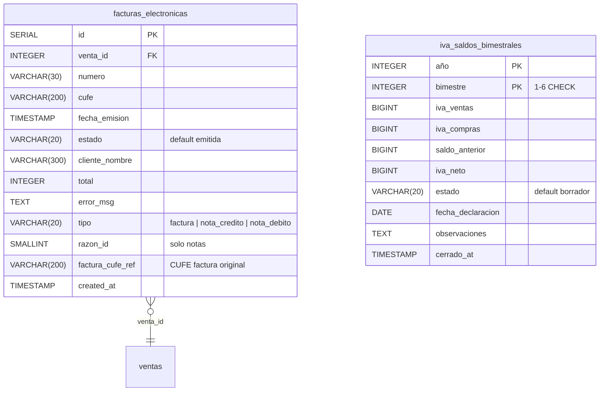

**Hechos**:
- Tabla **polimórfica**: la misma tabla guarda facturas, notas crédito y notas débito según `tipo`.
- `factura_cufe_ref` apunta a otra fila de la misma tabla **pero no es FK** (es VARCHAR comparando a `cufe` de otra fila).
- `venta_id` se vuelve NULL si la venta se borra (`ON DELETE SET NULL`).
- Índices: `idx_facturas_venta`, `idx_facturas_cufe`, `idx_facturas_tipo`, `idx_facturas_cufe_ref`.
- `iva_saldos_bimestrales`: PK compuesta `(año, bimestre)`, CHECK `bimestre BETWEEN 1 AND 6`.

### 3.9. Honorarios (Cuentas de Cobro + DSNO)

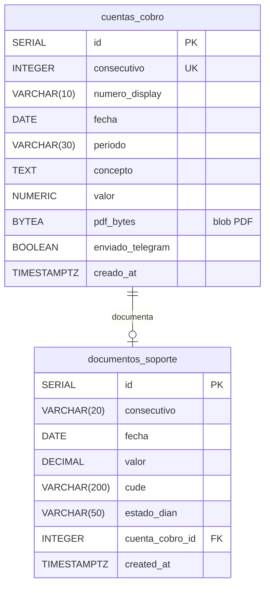

**Hechos**:
- `cuentas_cobro.pdf_bytes BYTEA` — **PDF como blob en la BD**. Consultas frecuentes a `lista` traen 0 PDFs porque el SELECT no incluye la columna, pero `/honorarios/pdf/{n}` debe leerlo.
- `documentos_soporte.consecutivo VARCHAR(20)` — **no es UNIQUE**, ¿es intencional?
- Job mensual genera 1 CC + 1 DSNO el día 23 a las 9 AM (APScheduler).

### 3.10. Pagos (Bancolombia)

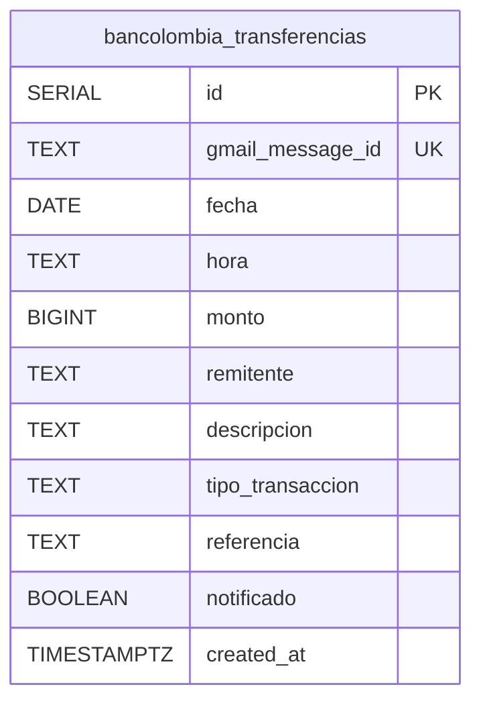

**Hechos**:
- `gmail_message_id UNIQUE` para idempotencia de webhook Gmail.
- Sin relación a `clientes`, `ventas` ni `fiados`: la conciliación es manual desde el dashboard.
- Bold y Wompi no tienen tabla — solo se reenvían a Telegram, sin persistir.

### 3.11. IA / Memoria

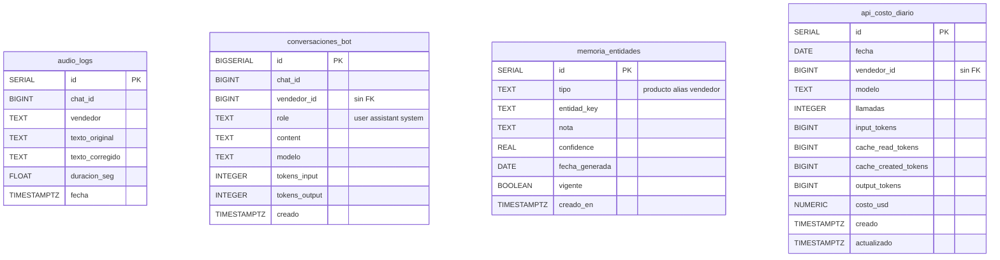

**Hechos**:
- Las 4 tablas son **arquitectura de memoria por capas** del bot:
  - Capa 1 (`conversaciones_bot`): turno-por-turno persistido (FTS español + trigram).
  - Capa 2 implícita: `ventas_state.historiales` en memoria.
  - Capa 3 (`ventas_detalle` con FTS + trigram): búsqueda histórica de productos vendidos.
  - Capa 4 (`memoria_entidades`): notas estructuradas generadas por el compresor nocturno (3 AM).
- `vendedor_id BIGINT` en varias tablas IA pero **sin FK a usuarios.id** — son ints arbitrarios (puede ser telegram_id o usuario_id, hay ambigüedad).
- `api_costo_diario` UNIQUE `(fecha, vendedor_id, modelo)` permite UPSERT diario.
- `audio_logs` no tiene FK a `usuarios`: `vendedor TEXT` denormalizado.

### 3.12. Configuración

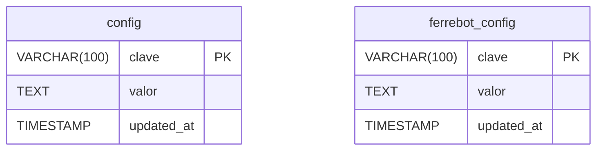

**Inconsistencia notable**:
- `config` creada en `db._init_schema()` con seed `('keepalive_activo','false')` y `('version','v9.0-arch')`.
- `ferrebot_config` creada en migración 012 — propósito declarado: guardar `gmail_last_history_id`.
- **Ambas tablas tienen el mismo esquema y propósito**. Posible deuda técnica (Fase 4).

---

## 4. Foreign keys — inventario explícito

| Tabla origen | Columna | → Tabla destino | ON DELETE | Notas |
|---|---|---|---|---|
| productos_fracciones | producto_id | productos(id) | CASCADE | |
| inventario | producto_id | productos(id) | CASCADE | UNIQUE |
| ventas | cliente_id | clientes(id) | (default NO ACTION) | sin índice |
| ventas | usuario_id | usuarios(id) | (default) | idx_ventas_usuario_id |
| ventas_detalle | venta_id | ventas(id) | CASCADE | |
| ventas_detalle | producto_id | productos(id) | (default) | |
| gastos | usuario_id | usuarios(id) | (default) | idx_gastos_usuario_id |
| compras | producto_id | productos(id) | (default) | |
| compras | factura_proveedor_id | facturas_proveedores(id) | (default) | |
| compras | compra_fiscal_id | compras_fiscal(id) | SET NULL | |
| compras | usuario_id | usuarios(id) | (default) | idx_compras_usuario_id |
| compras_fiscal | producto_id | productos(id) | (default) | |
| compras_fiscal | compra_origen_id | compras(id) | SET NULL | |
| compras_fiscal | usuario_id | ❌ **sin FK** | — | INTEGER suelto |
| facturas_abonos | factura_id | facturas_proveedores(id) | CASCADE | |
| facturas_proveedores | usuario_id | usuarios(id) | (default) | idx_facturas_proveedores_usuario_id |
| fiados | cliente_id | clientes(id) | (default) | UNIQUE |
| facturas_electronicas | venta_id | ventas(id) | SET NULL | |
| documentos_soporte | cuenta_cobro_id | cuentas_cobro(id) | (default) | |

> Las dependencias **NO ACTION** son frágiles: borrar un `cliente` que tenga `ventas` lanza error de constraint en runtime. No es un bug, pero la app no maneja el error explícitamente.

---

## 5. Índices — inventario

| Tabla | Índice | Tipo | Nota |
|---|---|---|---|
| productos | idx_productos_aliases | GIN | búsqueda fuzzy |
| productos_fracciones | uq_prod_fraccion | UNIQUE btree | (producto_id, fraccion) |
| ventas | idx_ventas_fecha | btree | |
| ventas | idx_ventas_consecutivo | btree | |
| ventas | idx_ventas_usuario_id | btree | RBAC |
| ventas | **falta** idx_ventas_cliente_id | — | queries por cliente hacen seq scan |
| ventas_detalle | idx_ventas_detalle_venta | btree | |
| ventas_detalle | ventas_detalle_producto_fts_idx | GIN FTS español | |
| ventas_detalle | ventas_detalle_producto_trgm_idx | GIN trigram | typos |
| gastos | idx_gastos_fecha | btree | |
| gastos | idx_gastos_usuario_id | btree | RBAC |
| compras | idx_compras_usuario_id | btree | RBAC |
| compras_fiscal | idx_compras_fiscal_fecha | btree | |
| compras_fiscal | idx_compras_fiscal_iva | btree parcial | WHERE incluye_iva=TRUE |
| compras_fiscal | idx_compras_fiscal_origen | btree parcial | WHERE compra_origen_id IS NOT NULL |
| compras_fiscal | idx_compras_fiscal_cufe | btree parcial | WHERE cufe_proveedor IS NOT NULL |
| compras_fiscal | idx_compras_fiscal_evento_estado | btree | |
| compras_fiscal | idx_compras_fiscal_gmail_msg | UNIQUE parcial | WHERE gmail_message_id IS NOT NULL |
| compras_fiscal | idx_compras_fiscal_gmail_not_null | btree parcial | created_at DESC |
| facturas_proveedores | idx_facturas_proveedores_usuario_id | btree | RBAC |
| facturas_electronicas | idx_facturas_venta | btree | |
| facturas_electronicas | idx_facturas_cufe | btree | |
| facturas_electronicas | idx_facturas_tipo | btree | |
| facturas_electronicas | idx_facturas_cufe_ref | btree | |
| audio_logs | audio_logs_fecha_idx | btree DESC | |
| bancolombia_transferencias | idx_bancolombia_transferencias_fecha | btree DESC | |
| api_costo_diario | api_costo_diario_fecha_idx | btree DESC | |
| api_costo_diario | api_costo_diario_vendedor_idx | btree | |
| conversaciones_bot | conversaciones_bot_chat_creado_idx | btree | (chat_id, creado DESC) |
| conversaciones_bot | conversaciones_bot_creado_idx | btree | |
| conversaciones_bot | conversaciones_bot_content_fts_idx | GIN FTS español | |
| conversaciones_bot | conversaciones_bot_content_trgm_idx | GIN trigram | |
| conversaciones_bot | conversaciones_bot_vendedor_idx | btree parcial | WHERE vendedor_id IS NOT NULL |
| memoria_entidades | memoria_entidades_lookup_idx | btree | (tipo, entidad_key, vigente, fecha_generada DESC) |
| memoria_entidades | memoria_entidades_fecha_idx | btree | cleanup |
| cuentas_cobro | ix_cuentas_cobro_fecha | btree DESC | |
| documentos_soporte | ix_documentos_soporte_fecha | btree DESC | |

**Faltantes detectados**:
- `ventas.cliente_id` (consultas "historial de cliente").
- `fiados.nombre` o `fiados.cliente_id` (queries fuzzy del bot).
- `clientes.identificacion` (búsqueda por NIT/cédula).
- `clientes.telefono` (búsqueda inversa por número).
- `historico_ventas` solo tiene `fecha PK`, no necesita más.

---

## 6. Constraints — invariantes asegurados por la BD

| Constraint | Tabla | Garantiza |
|---|---|---|
| `consecutivo, fecha` UNIQUE | ventas | un consecutivo por día |
| `producto_id` UNIQUE | inventario | 1:1 con productos |
| `cliente_id` UNIQUE | fiados | 1 fila de fiado por cliente |
| `telegram_id` UNIQUE | usuarios | 1 usuario por telegram_id |
| `clave` PK | productos | clave de catálogo única |
| `clave` PK | config / ferrebot_config | clave única |
| `fecha` UNIQUE | caja | una fila por día |
| `fecha` PK | historico_ventas | una fila por día |
| `(producto_id, fraccion)` UNIQUE | productos_fracciones | una fracción por producto |
| `(año, bimestre)` PK | iva_saldos_bimestrales | un saldo por bimestre |
| `gmail_message_id` UNIQUE | bancolombia_transferencias | idempotencia |
| `(gmail_message_id, producto_nombre)` UNIQUE parcial | compras_fiscal | idempotencia Gmail compras |
| `(tipo, entidad_key, fecha_generada)` UNIQUE | memoria_entidades | un nota por día por entidad |
| `(fecha, vendedor_id, modelo)` UNIQUE | api_costo_diario | UPSERT diario |
| `bimestre BETWEEN 1 AND 6` CHECK | iva_saldos_bimestrales | rango válido |
| `role IN ('user','assistant','system')` CHECK | conversaciones_bot | enum role |
| `tipo IN ('producto','alias','vendedor')` CHECK | memoria_entidades | enum tipo |

**Invariantes que la app mantiene pero la BD no** (riesgo: inconsistencia silenciosa):
- `facturas_proveedores.pagado + pendiente = total`.
- `caja.efectivo + transferencias + datafono = total del día`.
- `ventas.usuario_id` vs `ventas.vendedor` (string) deben coincidir.
- `fiados.nombre` vs `clientes.nombre`.
- `clientes.ciudad_nombre` vs `clientes.municipio_dian` (DANE).
- `ventas.factura_estado='emitida'` ⇒ existe fila en `facturas_electronicas` con esa `venta_id`.
- `compras_fiscal.compra_origen_id` apunta a una fila de `compras` cuya `compra_fiscal_id` apunta a esta fila (relación recíproca).

---

## 7. Tipos de datos — observaciones

| Patrón | Frecuencia | Comentario |
|---|---|---|
| Montos como `INTEGER` (no DECIMAL) | mayoría | Pesos colombianos sin decimales; OK pero `iva_saldos_bimestrales` usa `BIGINT` (inconsistente). `cuentas_cobro.valor` usa `NUMERIC(15,2)` y `documentos_soporte.valor` usa `DECIMAL(12,2)` — **3 estilos distintos** para el mismo concepto. |
| `cantidad NUMERIC(10,3)` | ventas_detalle, inventario, compras | Soporta fracciones 0.001 — diseño correcto para ferretería. |
| `id VARCHAR(20)` | facturas_proveedores | PK alfanumérica (`FAC-001`) — válido pero atípico. |
| `BYTEA` | cuentas_cobro.pdf_bytes | PDF como blob — fácil pero limita escalabilidad. |
| `TIMESTAMP` vs `TIMESTAMPTZ` | mezclados | `productos`, `ventas`, `gastos` usan `TIMESTAMP` (sin TZ); tablas nuevas (`audio_logs`, `conversaciones_bot`, `memoria_entidades`, `cuentas_cobro`, `documentos_soporte`, `bancolombia_transferencias`, `api_costo_diario`) usan `TIMESTAMPTZ`. **Inconsistencia importante** — afecta queries cross-tabla. |
| `DATE` para fechas Colombia | mayoría | OK porque la app convierte a Bogotá antes de insertar; pero requiere disciplina (CLAUDE.md §2). |
| `VARCHAR(300)` para nombres | productos, ventas, compras… | Largo, evita problemas de truncado. |
| `TEXT[]` con GIN | productos.aliases | Buen uso de arrays nativos Postgres. |

---

## 8. Migraciones — discrepancias y solapamientos

### 8.1. Doble definición de schema

`db._init_schema()` inline en `db.py` y `migrations/*.py` **comparten responsabilidad**:

- Tablas creadas en `db._init_schema()`: productos, productos_fracciones, inventario, clientes, ventas, ventas_detalle, gastos, caja, fiados, facturas_proveedores, facturas_abonos, historico_ventas, compras, config, audio_logs.
- Tablas creadas SOLO en migrations: usuarios (004), facturas_electronicas (008), iva_saldos_bimestrales (009), compras_fiscal (010), ferrebot_config (012), bancolombia_transferencias (016), api_costo_diario (017), conversaciones_bot (018), memoria_entidades (020), cuentas_cobro (021), documentos_soporte (022).
- Columnas creadas en *ambos* lados (idempotente `ADD COLUMN IF NOT EXISTS`): casi todas las nuevas columnas de productos, clientes, ventas, compras, fiados, historico_ventas, inventario.

**Consecuencia**: un usuario nuevo que clone el repo y arranque API obtendrá **un subset del esquema** desde `_init_schema()`, pero le faltarán `usuarios`, `compras_fiscal`, `facturas_electronicas`, etc. — el RBAC, la facturación electrónica y todo lo fiscal **no funcionarán** hasta correr las 30 migraciones manualmente. Esto es **clave para el onboarding** (Fase 7).

### 8.2. Numeración duplicada

| Prefijo | Archivos | Conflicto |
|---|---|---|
| 004 | `004_migrate_gastos_caja.py`, `004_usuarios_auth.py` | gastos+caja vs RBAC — orden ambiguo |
| 011 | `011_add_admin_nuevo_cel.py`, `011_clientes_campos_fe.py`, `011_gmail_compras.py` | 3 archivos |
| 012 | `012_ferrebot_config.py`, `012_fix_regimen_fiscal.py` | crear tabla vs fix dato |
| 013 | `013_notas_electronicas.py`, `013_productos_iva_19.py` | schema vs data |
| 016 | `016_audio_logs.py`, `016_bancolombia_transferencias.py` | dos tablas distintas |

### 8.3. No hay tabla `schema_migrations`

No existe registro automático de qué migraciones se han corrido. **El operador debe recordar** cuáles ya aplicó. Las migraciones son **idempotentes** (`CREATE TABLE IF NOT EXISTS`, `ADD COLUMN IF NOT EXISTS`), lo cual mitiga el riesgo de re-aplicar, pero:
- Las migraciones que insertan datos puntuales (`011_add_admin_nuevo_cel`, `014_iva_productos`, `023_insertar_ds5_manual`) **pueden producir duplicados o efectos no deseados** si se corren dos veces.
- Sin orden estricto, una colisión 011 puede ejecutarse antes o después de la otra dependiendo de cómo el operador las invoque.

---

## 9. Inconsistencias y deuda detectada (resumen — detalle en Fase 4)

1. **2 tablas `config` con el mismo propósito** (`config`, `ferrebot_config`).
2. **`compras_fiscal.usuario_id` sin FK** a `usuarios(id)`.
3. **Falta índice** en `ventas.cliente_id`, `fiados.nombre`, `clientes.identificacion`, `clientes.telefono`.
4. **TIMESTAMPTZ vs TIMESTAMP mezclados** — riesgo con queries cross-tabla en zonas horarias.
5. **3 tipos para montos**: INTEGER, BIGINT (iva), NUMERIC(15,2) (cc), DECIMAL(12,2) (ds).
6. **PDFs en BYTEA** (`cuentas_cobro`) — puede inflar la BD si crecen las CC.
7. **Doble fuente de verdad**: `db._init_schema()` + migrations.
8. **Numeración duplicada** en 5 prefijos de migraciones.
9. **Sin tabla `schema_migrations`** ni control automático de versiones de esquema.
10. **Denormalizaciones sin invariante**: `ventas.vendedor` (string) vs `usuario_id` (FK); `compras_fiscal.proveedor` vs `facturas_proveedores.proveedor`.
11. **`facturas_electronicas` polimórfica** (factura + nota crédito + nota débito) — funciona pero complica reglas de negocio.
12. **CHECK constraints muy puntuales** — la mayoría de invariantes son responsabilidad de la app.
13. **`vendedor_id BIGINT` ambiguo** en tablas IA (`conversaciones_bot`, `api_costo_diario`): ¿telegram_id o `usuarios.id`?
14. **Seeds hardcoded** en `db._init_schema()` y migración 004 (telegram_id 1831034712 = Andrés). Datos específicos de Punto Rojo en el código de inicialización (Fase 5).
15. **`clientes.municipio_dian DEFAULT 149`** (= Cartagena) — específico Punto Rojo.
16. **`clientes.ciudad_nombre DEFAULT 'Cartagena'`** — específico Punto Rojo.

---

## 10. Resumen para fase de extracción a template

**Para una nueva ferretería, el modelo de datos requiere**:

- **Limpieza obligatoria**:
  - Eliminar seeds hardcoded (admin telegram_id, ciudad por defecto, NIT).
  - Definir un punto único de verdad: o todo en migrations, o todo en `_init_schema()`. Recomendación: usar Alembic o similar.
  - Renumerar migraciones sin colisiones.
- **Parametrizable por ferretería** (a sacar a `config` o env):
  - Régimen IVA por defecto (responsable/no responsable).
  - Ciudad por defecto (display + DANE + MATIAS).
  - Prefijos DIAN (FE, DSNO).
  - Valor honorarios mensuales.
  - Admin inicial (telegram_id, nombre).
- **Reutilizable tal cual** (~85% del esquema):
  - Catálogo, inventario, ventas, ventas_detalle, productos_fracciones, compras, compras_fiscal, facturas_proveedores, facturas_abonos, fiados, gastos, caja, historico_ventas, clientes, usuarios.
- **Opcional por ferretería** (módulos):
  - Facturación electrónica (`facturas_electronicas`, `iva_saldos_bimestrales`, `documentos_soporte`, `cuentas_cobro`).
  - Bancolombia (`bancolombia_transferencias`).
  - Bold / Wompi (sin tabla, solo webhook).
  - Gmail (compras_fiscal.gmail_message_id, ferrebot_config con history_id).
  - IA avanzada (`conversaciones_bot`, `memoria_entidades`, `api_costo_diario`, `audio_logs`).

**Siguiente paso**: Fase 3 — extracción de la lógica de negocio por dominio con sus flujos en mermaid.
