# 03 · Lógica de negocio por dominio

> Auditoría exhaustiva — Fase 3 de 8.
> Objetivo: extraer las reglas de negocio, flujos y dependencias de cada dominio del sistema, distinguiendo qué es reutilizable de qué es específico de Punto Rojo. Cada dominio incluye al menos un diagrama mermaid del flujo.

---

## 1. Ventas

El dominio más complejo. Una venta puede entrar por **5 caminos distintos** que terminan en la misma tabla `ventas` + `ventas_detalle`.

### 1.1. Caminos de entrada de una venta

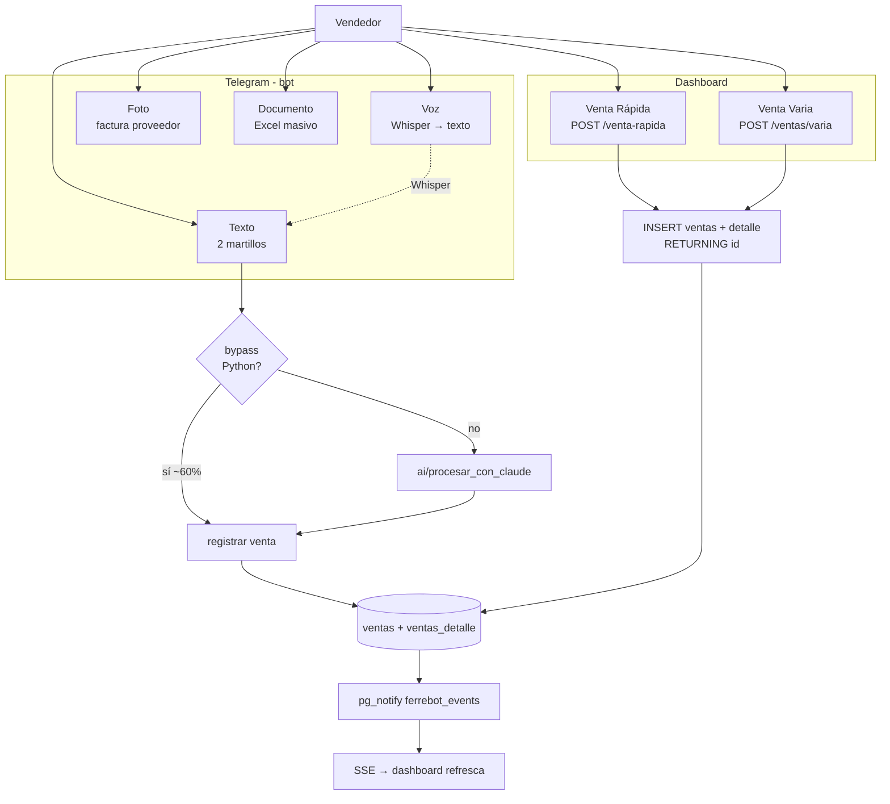

### 1.2. Flujo del bypass (Python sin Claude)

El bypass en `bypass.py` resuelve ~60% de los mensajes en <5 ms. **Es uno de los activos más valiosos del proyecto**.

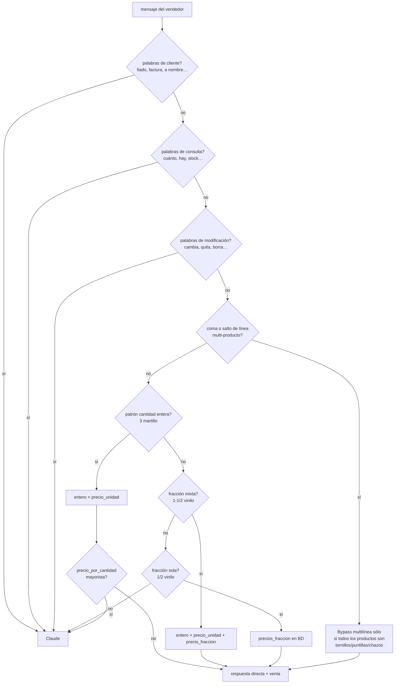

**Reglas clave del bypass** (de `bypass.py`):

- **Bloqueadores semánticos** (van a Claude):
  - Palabras de cliente: `fiado, a nombre, cuenta de, credito, factura, abono, debe, saldo, deuda`.
  - Palabras de consulta: `cuanto, vale, precio, hay, stock, queda, vendimos, reporte`.
  - Palabras de modificación: `cambia, quita, agrega, borra, error, cancela, olvida`.
  - "para Nombre-propio" (heurística con regex — "bandeja para rodillo" sí pasa, "para Juan" no).
- **Normalización**:
  - Quita tildes y `ñ`.
  - Convierte `#120 → n120` (lijas).
  - Preserva fracciones antes de quitar especiales (`1/4 → 1_4`).
  - Plurales: `tornillos → tornillo`, `puntillas → puntilla`, `chazos → chazo`, además heurística genérica de quitar `s`/`es` finales en palabras de 4+ letras.
- **Búsqueda en catálogo**: match exacto por slug → coincidencia por palabras (todas las del mensaje ⊆ palabras del producto) → más específico (más palabras).
- **Fracciones soportadas**: `1/16, 1/8, 1/4, 3/8, 1/2, 3/4` y sus equivalentes en texto (`medio, cuarto, tres cuartos, un octavo`).
- **Mixta**: `N + fracción × precio_unidad + precio_fraccion[clave]`, con 3 formatos: `1-1/2`, `1 1/2`, `1 y medio`.

**Constantes específicas de Punto Rojo**:
- Lista de plurales hardcoded (`tornillo`, `puntilla`, `chazo`, `plastico`). Otras ferreterías tendrán otros productos comunes.
- Heurística "lija $60 → lija #60" sólo aplica a productos lija.

### 1.3. Flujo Claude (cuando el bypass no resuelve)

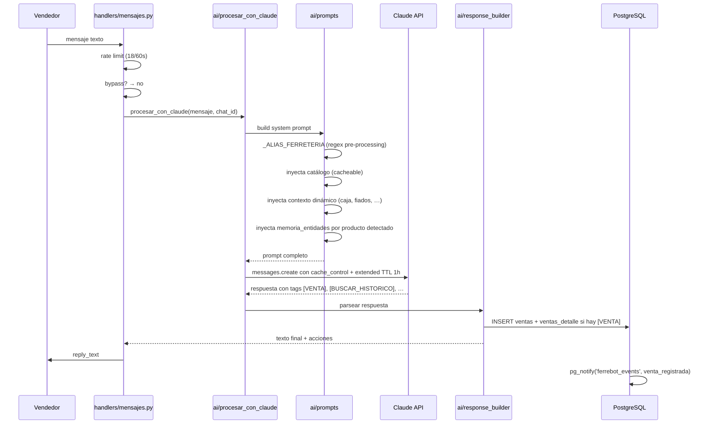

**Capas de memoria del bot** (declarado en migrations 018-020):
- **Capa 1** — `conversaciones_bot`: cada turno (user/assistant/system) persistido en PG con FTS español + trigram.
- **Capa 2** — `ventas_state.historiales` en memoria, sobrevive solo al proceso.
- **Capa 3** — `ventas_detalle` con FTS + trigram: búsqueda histórica de productos vendidos.
- **Capa 4** — `memoria_entidades`: notas generadas cada noche (3 AM) por el compresor (Haiku), inyectadas en el prompt cuando el mensaje menciona la entidad.

**Tags reconocidos** (extraído de `ai/prompts.py`):
- `[VENTA]…[/VENTA]` — registrar una venta.
- `[BUSCAR_HISTORICO]{...}[/BUSCAR_HISTORICO]` — el sistema reemplaza por resultados FTS.
- `[BUSCAR_MEMORIA]{...}[/BUSCAR_MEMORIA]` — notas de Capa 4.
- Otros (`[CLIENTE_NUEVO]`, `[ALIAS]`, etc.) presentes en handlers/parsing.

**Budget tracking** (`ai/budget.py`, migración 017): hard limits diarios por vendedor + modelo:
- `BUDGET_SONNET_DIARIO` (default 300 llamadas/día).
- `BUDGET_HAIKU_DIARIO` (default 1000 llamadas/día).
- Tabla `api_costo_diario` con UPSERT (fecha, vendedor_id, modelo).

### 1.4. Venta Rápida (dashboard)

`POST /venta-rapida` en `routers/ventas.py` registra una venta multi-producto en una transacción:
1. Resuelve `producto_id` por nombre.
2. Calcula precio unitario.
3. **Toma el siguiente consecutivo con `MAX(consecutivo) + 1` sobre TODA la tabla, NO por fecha**. Esto contradice `db.obtener_siguiente_consecutivo()` (que filtra por fecha). Discrepancia importante (Fase 4).
4. INSERT en `ventas` + N INSERTs en `ventas_detalle` dentro del mismo `with _db._get_conn()`.
5. Descuento de inventario *después* del commit (no es atómico con la venta — si descontar falla, la venta queda registrada pero el stock no).
6. `await notify_all("venta_registrada", {...})`.

### 1.5. Venta Varia (ajuste de caja)

`POST /ventas/varia` registra una venta con `ventas_detalle.sin_detalle=TRUE` y `producto_nombre` en una lista hardcoded (`Venta Varia`, `Ventas Varias`, `Excedente de caja`, …). Estas se **excluyen del top de productos** en los rankings de `/ventas/top` y `/ventas/top2`.

### 1.6. Reglas de negocio

| Regla | Dónde | Comentario |
|---|---|---|
| Consecutivo por fecha (bot) | `db.obtener_siguiente_consecutivo()` | reinicia cada día |
| Consecutivo global (dashboard venta-rápida) | `routers/ventas.py:365` | **contradice** la regla anterior |
| Métodos de pago | string libre + InlineKeyboard | `efectivo, transferencia, datafono, datafono+efectivo, fiado, nequi, daviplata, bold, wompi, bancolombia` (no enum) |
| Hora Colombia siempre | `_dt.datetime.now(config.COLOMBIA_TZ)` | UTC del servidor causaría drift |
| Venta sin detalle (Varia) | `sin_detalle=TRUE` | excluida del top |
| Vendedor denormalizado | `ventas.vendedor` (string) | + `usuario_id` (FK). Doble registro. |
| Cliente CF por defecto | `cliente_nombre='Consumidor Final'`, `cliente_id=NULL` | `db.obtener_nombre_id_cliente()` retorna `('CF', 'Consumidor Final')` |

---

## 2. Caja

### 2.1. Estados

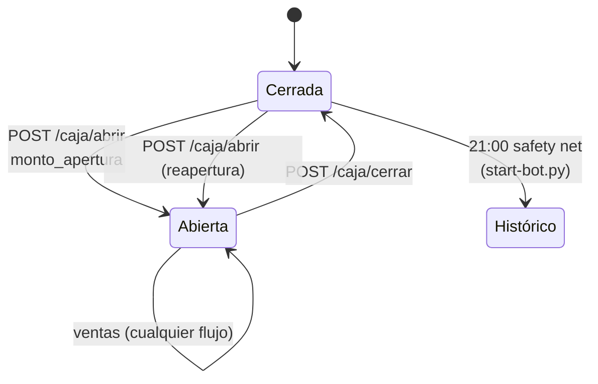

### 2.2. Reglas

- **Una fila por día** (`caja.fecha UNIQUE`).
- Reapertura: **NO se resetean** `efectivo / transferencias / datafono` porque `GET /caja` los recalcula desde la tabla `ventas`.
- **Cierre**: `UPDATE caja SET abierta=FALSE, cerrada_at=NOW()`. Calcula resumen inline (sin depender de `memoria.obtener_resumen_caja`).
- **Efectivo esperado** = `monto_apertura + efectivo_ventas - gastos_caja`.
- `gastos.origen` discrimina:
  - `'caja'` — sale del cash drawer.
  - `'externo'` / `'bot'` — no afecta efectivo esperado.

### 2.3. Histórico safety net

Hilo daemon en `start-bot.py`:
```
while True:
    sleep 1h
    if hora_colombia >= 21:00 and no hay registro en historico_ventas[hoy]:
        _sync_historico_hoy()
```
Es un *fallback* por si el vendedor olvidó cerrar el día. **Es una decisión de negocio específica**: 21:00 = hora de cierre típica de la ferretería.

### 2.4. Bug detectado

`routers/caja.py:172-173` — `return {...}` antes de `await notify_all("caja_abierta", ...)` → la línea es **código muerto**. La apertura de caja **nunca notifica al dashboard** (`/caja/cerrar` sí lo hace correctamente).

---

## 3. Inventario / Kardex

### 3.1. Modelo conceptual

Cada producto del catálogo (`productos`) tiene **opcionalmente** una fila en `inventario` con stock numérico, costo promedio, etc. La relación es 1:1 vía `inventario.producto_id UNIQUE`.

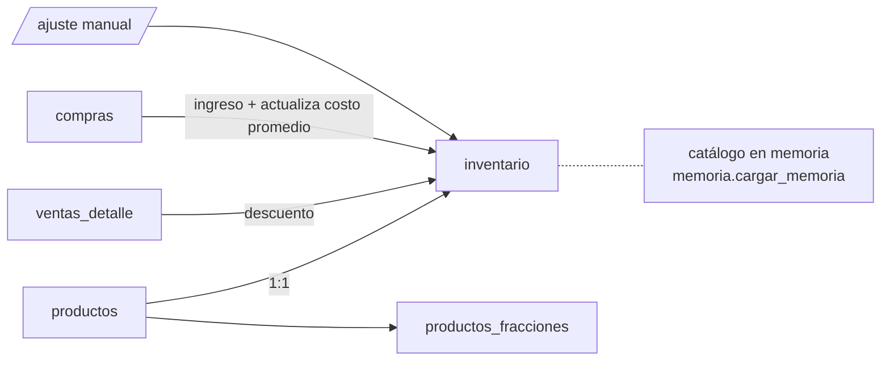

### 3.2. Operaciones

- `cargar_inventario()` → dict desde caché de memoria.
- `descontar_inventario(nombre, cantidad)` → contrato crítico `(bool, str|None, float|None)` que `ventas_state.py:210` destructura. **Cualquier cambio rompe ventas silenciosamente**.
- `_upsert_inventario_producto_postgres()` con `ON CONFLICT (producto_id) DO UPDATE`.
- `verificar_alertas_inventario()` — productos con `cantidad <= minimo` (default `minimo=3`).
- **Búsqueda** en `inventario_service.buscar_clave_inventario()`:
  - Exacta por clave normalizada.
  - Exacta por `nombre_original` lowercase.
  - Por palabras (todas las del término en el nombre).
  - Scoring 3/2/1 según completitud.

### 3.3. Reglas

- **Catálogo y inventario son dos cosas distintas**: un producto puede estar en catálogo y no tener inventario (productos nuevos sin stock asignado).
- `inventario.unidad` ≠ `productos.unidad_medida` — puede haber drift entre ambos.
- `costo_promedio` se actualiza con ponderación al registrar compras (lógica en `services/inventario_service.py` y `services/catalogo_service.py`).
- **Descuento ocurre fuera de transacción con la venta** (routers/ventas.py:409) — si falla, la venta queda registrada pero el stock no.

### 3.4. Fracciones (productos_fracciones)

- Pinturas, disolventes, plásticos, etc.: `1/4`, `1/2`, `3/4`, `1/8`, `1/16`.
- Tabla con `precio_total` y `precio_unitario` por fracción (calculados a partir del precio entero).
- `UNIQUE(producto_id, fraccion)` permite UPSERT.

### 3.5. Mayorista por cantidad

- 3 columnas en `productos`: `precio_umbral`, `precio_bajo_umbral`, `precio_sobre_umbral`.
- Semántica: si la cantidad vendida ≤ umbral → `precio_bajo_umbral`; si > umbral → `precio_sobre_umbral`. Ejemplo: tornillería `umbral=50, bajo=200, sobre=150`.
- El bypass detecta esto y **deshabilita** el bypass si el producto tiene umbral (`Bypass + mayorista = inconsistente → Claude resuelve`).

---

## 4. Fiados (cuentas por cobrar a clientes)

### 4.1. Modelo

Una fila por cliente con `saldo_actual` acumulado. **No hay tabla de movimientos** — los movimientos viven en `gastos` (abonos del cliente) y `ventas` (fiar). El histórico que muestra `detalle_fiado_cliente()` viene de la lista en memoria (`cargar_memoria().fiados`) que se hidrata de la DB pero no se persiste con historial completo en PG.

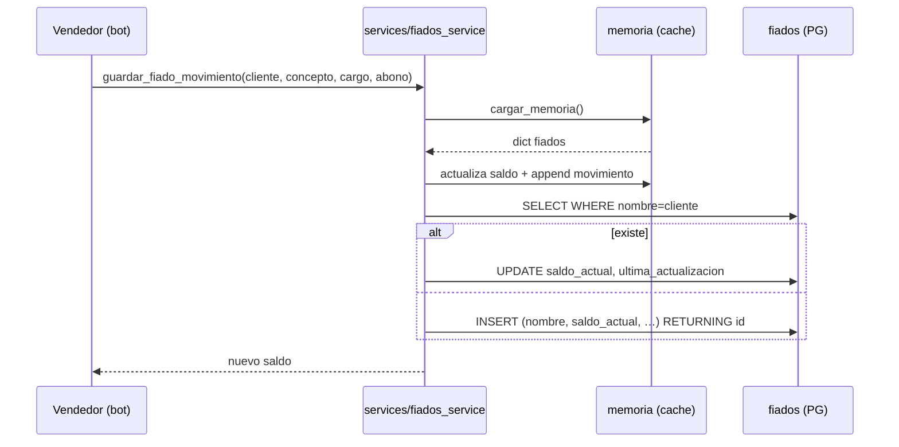

### 4.2. Reglas

- Búsqueda flexible `_buscar_cliente_fiado()`: exacta normalizada → contenida en otro → todas las palabras coinciden.
- Saldo ≤ 0 después de abono → "paz y salvo".
- **Sin transacciones** alrededor del UPDATE/INSERT — race condition posible si dos abonos llegan simultáneos.
- **Memoria como fuente de verdad parcial**: los `movimientos` viven en `_cache` pero no se persisten en la tabla `fiados` (sólo el saldo). Si el proceso se reinicia, **se pierde la lista de movimientos** del día (no el saldo).

### 4.3. Bug latente

`fiados.nombre` es string libre; si el cliente cambia nombre en `clientes.nombre`, **`fiados.nombre` no se actualiza automáticamente**. Búsqueda fuzzy puede empezar a fallar.

---

## 5. Proveedores (cuentas por pagar)

### 5.1. Modelo

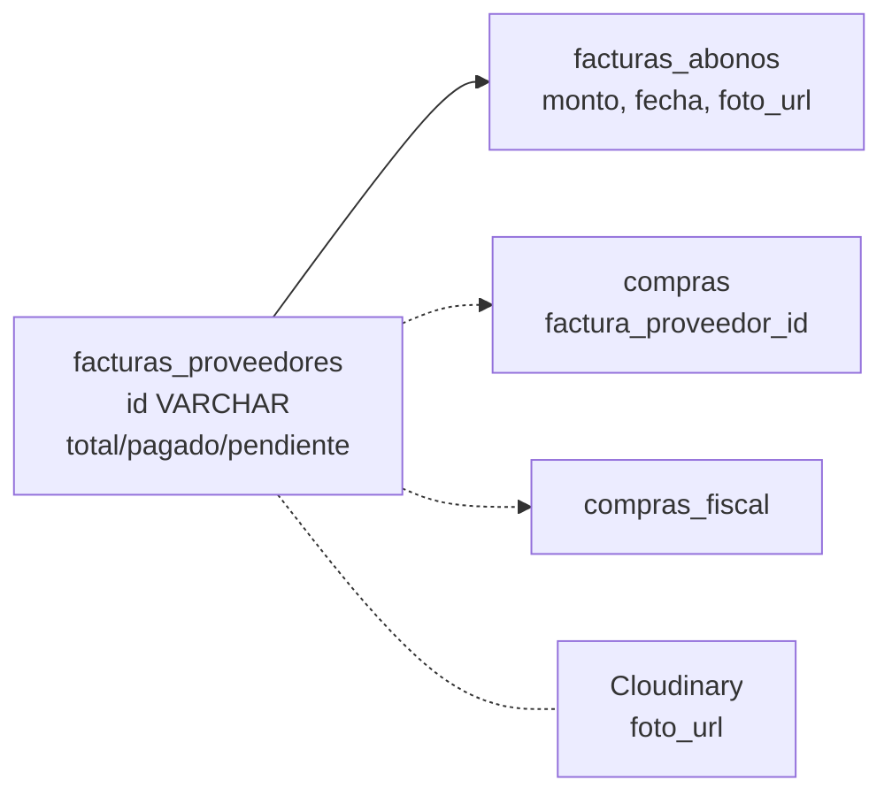

### 5.2. Reglas

- `id` es PK VARCHAR(20) generado por la app (`FAC-001` o similar).
- Invariante NO asegurada por BD: `pagado + pendiente = total`.
- Foto opcional en Cloudinary (`POST /proveedores/facturas/{fac_id}/foto`).
- Abonos parciales acumulables — cada uno reduce `pendiente`.
- `estado IN ('pendiente', 'parcial', 'pagada')` — mantenido por la app, sin CHECK.
- `compras.factura_proveedor_id` puede ser NULL (compra sin factura) o apuntar a `facturas_proveedores.id`. Estado `compras.estado_fiscal IN ('sin_factura', 'con_factura', 'pasada_a_fiscal')`.

### 5.3. Reclamos DIAN

Eventos RADIAN: `POST /proveedores/aceptar`, `POST /proveedores/reclamar`, `POST /proveedores/reintentar-030`. Cada evento se registra en `compras_fiscal.evento_030_at|031|032|033` y modifica `evento_estado`.

---

## 6. Facturación electrónica DIAN (vía MATIAS API)

Probablemente el dominio **más alejado del core de ferretería** y el más específico de Colombia + MATIAS.

### 6.1. Tipos de documento

| Tipo | Tabla | Endpoint MATIAS | Trigger |
|---|---|---|---|
| Factura electrónica (FE) | `facturas_electronicas` (`tipo='factura'`) | `POST /invoice` | manual desde dashboard |
| Nota crédito | `facturas_electronicas` (`tipo='nota_credito', razon_id`) | `POST /credit-note` | manual |
| Nota débito | `facturas_electronicas` (`tipo='nota_debito'`) | `POST /debit-note` | manual |
| Documento Soporte (DS-NO) | `documentos_soporte` | `POST /ds/document` | automático día 23 |

### 6.2. Flujo de emisión

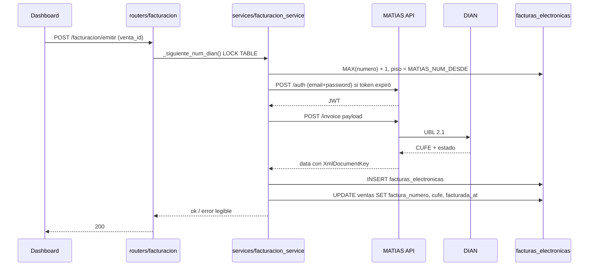

### 6.3. Reglas críticas

- **REGLA DE ORO MATIAS**: `POST` usa IDs internos MATIAS; `GET` usa códigos DIAN. Mantener mapeo `_TIPO_ID_MATIAS` (POST) y `_TIPO_ID_DIAN` (GET).
- **`identity_document_id` cambia de semántica** entre endpoints (`/invoice` → "1=CC, 3=NIT"; `/ds/document` → "3=CC" para AccountingSupplierParty XML). Esto es **muy frágil** — un comentario en `documento_soporte_service.py:48-52` lo documenta.
- **Cache de ciudades** (`_cities_cache`): `httpx.get(/cities)` al inicio; mapeo `DANE → MATIAS_id`. Lock `threading.Lock`.
- **TipoAmb**: 1=Producción, 2=Pruebas (controlado por `MATIAS_AMBIENTE`).
- **Unidades DIAN** (`_UNIDAD_DIAN`): mapeo manual `Unidad=70`, `Galón=686`, `Kg=767`, etc. Cualquier nueva unidad necesita actualizar este dict.
- **Reintentos**: 3 con backoff exponencial.
- **Bloqueo de consecutivo**: `LOCK TABLE ... IN SHARE ROW EXCLUSIVE MODE` antes de MAX + 1, asegura unicidad bajo concurrencia.

### 6.4. DS-NO (Documento Soporte para proveedor no obligado)

Andrés (el desarrollador) es el proveedor "no obligado a facturar" que cobra a la ferretería. El DS-NO es el documento DIAN que la **ferretería emite por la compra de servicios** al desarrollador. Se genera automáticamente el día 23 a las 9 AM junto con la Cuenta de Cobro.

- Datos del proveedor hardcoded en `services/documento_soporte_service.py:44-61` (`_PROVEEDOR` dict):
  - CC 1043295412
  - Andrés Felipe Malo Hernández
  - Dirección, mobile, email, ciudad Cartagena.
- Descripción del servicio hardcoded (`_DESCRIPCION_SERVICIO`) — contrato PSV-001-2026.
- **Esto es 100% específico de la relación Andrés ↔ Punto Rojo** — irrelevante para otras ferreterías a menos que también contraten al mismo desarrollador con el mismo esquema.

### 6.5. Webhook MATIAS

`POST /facturacion/webhook` recibe eventos asincrónos de DIAN/MATIAS y actualiza el estado de las facturas. Requiere `MATIAS_WEBHOOK_SECRET`.

---

## 7. Honorarios (Cuentas de Cobro)

### 7.1. Modelo

`cuentas_cobro` guarda el PDF completo (`BYTEA`) + metadata. `documentos_soporte` (DSNO) puede referenciar la CC.

### 7.2. Flujo mensual

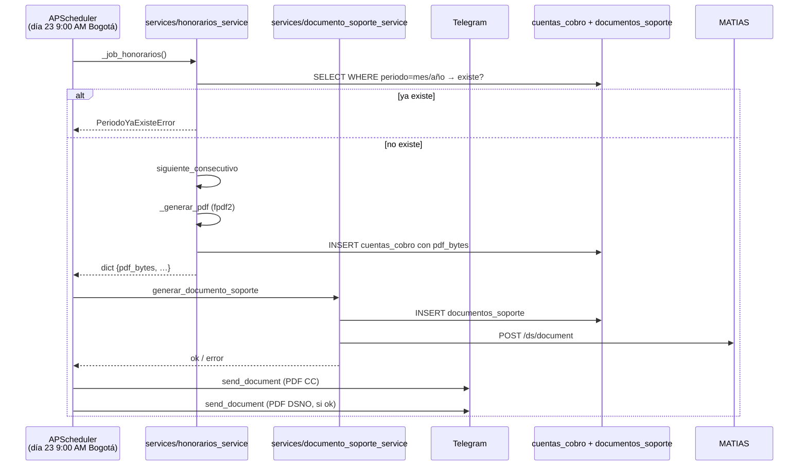

### 7.3. Reglas

- **Idempotencia por mes**: `SELECT WHERE periodo='Mayo 2026'` antes de generar; si existe, lanza `PeriodoYaExisteError`.
- Valor por defecto: `HONORARIOS_VALOR` env (default 2 000 000 COP).
- Concepto por defecto hardcoded (servicios de desarrollo del sistema).
- `numero_display` = `f"{consecutivo:03d}"` (`CC-001`, `CC-002`).
- PDF generado con `fpdf2` — firmado con imagen desde `FIRMAS_PATH=assets/firmas/`.

---

## 8. Bancolombia / Bold / Wompi

Tres integraciones de pagos con tratamientos distintos:

### 8.1. Bancolombia (vía Gmail Pub/Sub)

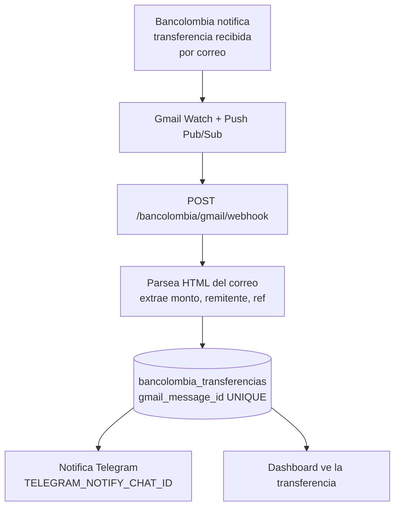

- **Idempotencia**: `gmail_message_id UNIQUE` previene doble registro si Pub/Sub re-entrega.
- **Renovación del watch**: cada 6 días (APScheduler en bot + asyncio task en api — duplicado).
- Sin relación a cliente/venta — la conciliación es manual.

### 8.2. Bold (datáfono / QR)

- `POST /bold/webhook` con `BOLD_WEBHOOK_SECRET`.
- **No persiste** — sólo reenvía a Telegram (`TELEGRAM_NOTIFY_CHAT_ID`).

### 8.3. Wompi (pagos en línea)

- `POST /wompi/webhook` con `WOMPI_EVENTS_SECRET`.
- **No persiste** — sólo reenvía a Telegram.

> Decisión de diseño: Bold y Wompi son canales de notificación, no fuentes de verdad de transacciones. Bancolombia sí persiste para conciliación contable.

---

## 9. Gmail webhook (compras a proveedores fiscales)

Cuando un proveedor envía una factura electrónica al correo de la ferretería, MATIAS API ya lo registra; este webhook captura **una notificación independiente desde Gmail Pub/Sub** y crea entradas en `compras_fiscal`:

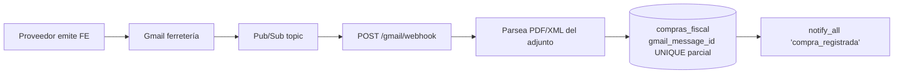

- `compras_fiscal` se hidrata directamente desde el correo cuando aplica.
- Idempotencia con UNIQUE parcial `(gmail_message_id, producto_nombre) WHERE gmail_message_id IS NOT NULL`.
- Renovación del watch: cada 6 días (asyncio task en api).
- Si no hay credenciales Gmail configuradas, el módulo se inicializa pero los webhooks rechazan.

---

## 10. RBAC (auth + autorización)

### 10.1. Bot — autenticación

`middleware/auth.py` aplica `@protegido` a cada handler:
1. Si `AUTHORIZED_CHAT_IDS` está vacío → **fail-open** (permite todo). En producción debe estar poblado.
2. Si `chat_id ∉ AUTHORIZED_IDS` → deniega.
3. Rate limit por `chat_id` (default 5 mensajes/2 s con `threading.Lock`).

### 10.2. API — autenticación

- `POST /auth/telegram` verifica la firma HMAC del Telegram Login Widget con `TELEGRAM_TOKEN`. Si pasa, genera JWT con `SECRET_KEY` (HS256) que incluye `usuario_id, telegram_id, nombre, rol`.
- `get_current_user(authorization: Bearer)` valida el JWT en cada request protegido.
- `/events` recibe el JWT como query param (`?token=...`) porque EventSource no soporta headers custom.

### 10.3. API — autorización (filtrado por usuario_id)

CLAUDE.md afirma: "vendedor ve solo sus datos, admin ve todo". **El código real NO implementa esto.**

`routers/deps.py`:
```python
def get_filtro_usuario(current_user=Depends(get_current_user)):
    return None  # ← siempre

def get_filtro_efectivo(vendor_id, current_user):
    if vendor_id:
        return vendor_id
    return None
```

- `get_filtro_usuario` siempre retorna `None` ("todos ven todo").
- `get_filtro_efectivo` retorna lo que `vendor_id` query param diga **sin verificar el rol**: un vendedor que pase `?vendor_id=99` ve los datos de otro vendedor.

**Esto es el hallazgo más grave del proyecto** y se desarrolla en Fase 4 §1.

### 10.4. Bot — RBAC en comandos

`auth/usuarios.py.is_admin(telegram_id)` se llama en handlers admin (`handlers/cmd_admin.py`). Si el usuario no es admin, el handler responde con un mensaje de rechazo. Aquí sí funciona el RBAC porque cada handler chequea explícitamente.

---

## 11. Tiempo real (SSE)

Documentado en `routers/events.py`. Resumen del flujo:

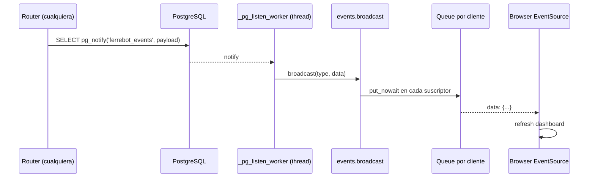

- **Semáforo de 3** en `notify_all` para limitar concurrencia (maxconn=10 en pool).
- Reconexión: `useRealtime.js` con backoff exponencial; emite evento sintético `'reconnected'` para que los consumers re-fetcheen.
- Heartbeat cada 25 s (acumulación de ciclos de 5 s). Desconexión detectada en ≤5 s.
- **Eventos conocidos**: `venta_registrada`, `caja_cerrada`, `inventario_actualizado`, `compra_registrada`, `gasto_registrado`, etc.

---

## 12. Reportes y derivados

### 12.1. `/resultados`

Cálculo del P&L del periodo seleccionado (semana, mes, año). Suma ventas, resta gastos+compras, calcula margen estimado por producto cruzando con `inventario.costo_promedio`.

### 12.2. `/kardex`

Listado de movimientos por producto: ventas + compras + ajustes. Construido por unión de queries — no hay tabla `kardex` formal.

### 12.3. `/proyeccion`

Proyección lineal del flujo de caja: promedio de los últimos N días × N días futuros. Heurística simple.

### 12.4. Libro IVA

`routers/libro_iva.py` ofrece resumen de IVA por bimestre cruzando `ventas` con `tiene_iva` de productos y `compras_fiscal.incluye_iva`. `POST /libro-iva/cerrar-bimestre` persiste el resultado en `iva_saldos_bimestrales`.

---

## 13. IA del dashboard (Chat Widget)

`routers/chat.py` ofrece:
- `POST /chat` — request/response sincrónico.
- `POST /chat/stream` — streaming SSE.
- `POST /chat/memoria` — control de memoria.
- `GET /chat/briefing` — resumen ejecutivo del día (genera el día actual en lenguaje natural).
- `GET /chat/reporte-datos` — datos estructurados para el chat.
- `GET /chat/export/{token}` — exporta el reporte como Excel.
- `POST /chat/transcribir` — audio → texto (Whisper).

**Selector Auto/Haiku/Sonnet** (`dashboard/src/components/ChatWidget.jsx`) — un toggle decide qué modelo usar. Auto = router heurístico de complejidad.

---

## 14. Resumen — qué es reutilizable vs específico Punto Rojo

> Esto es input directo para Fase 5.

| Dominio | Reutilizable | Parametrizable | Específico PR | Colombia-only |
|---|:-:|:-:|:-:|:-:|
| Ventas (modelo + flujo + bypass) | ✅ | parcial | listado plurales en bypass | no |
| Caja + gastos | ✅ | hora cierre 21:00 | — | no |
| Inventario + Kardex | ✅ | — | — | no |
| Fiados | ✅ | — | — | no |
| Proveedores (CxP + abonos) | ✅ | Cloudinary opcional | — | no |
| Catálogo + mayorista | ✅ | — | — | no |
| Fracciones (productos_fracciones) | ✅ | — | — | no |
| Facturación electrónica (MATIAS) | sólo si la nueva ferretería usa MATIAS | resolución, prefijo, NIT | — | ✅ |
| DS-NO (DSNO) | sólo si hay relación con proveedor no obligado | — | datos Andrés hardcoded | ✅ |
| Honorarios (CC) | sólo si quiere generar CC mensual | valor, concepto | datos Andrés/PR | parcial |
| Libro IVA | sólo si responsable IVA | — | — | ✅ |
| Bancolombia (Gmail) | sólo si quieren conciliar Bancolombia | credenciales OAuth | — | ✅ |
| Bold / Wompi | sólo si usan esos PSPs | secret | — | ✅ |
| Gmail compras fiscales | sólo si reciben facturas electronic por email | credenciales | — | ✅ |
| RBAC | ✅ (cuando se arregle) | admin inicial | telegram_id 1831034712 | no |
| Tiempo real (SSE + pg_notify) | ✅ | — | — | no |
| IA Chat dashboard | ✅ | budget, modelos | — | no |
| IA del bot (Claude + bypass + memorias) | ✅ | aliases ferretería | listado plurales | no |

**Conclusión**: el ~70% del código es reutilizable, el ~20% es parametrizable, y el ~10% es específico de Punto Rojo o Colombia-only (principalmente DIAN/MATIAS y datos personales hardcoded del desarrollador).

**Siguiente paso**: Fase 4 — hallazgos técnicos detallados con severidad y propuesta de fix.
