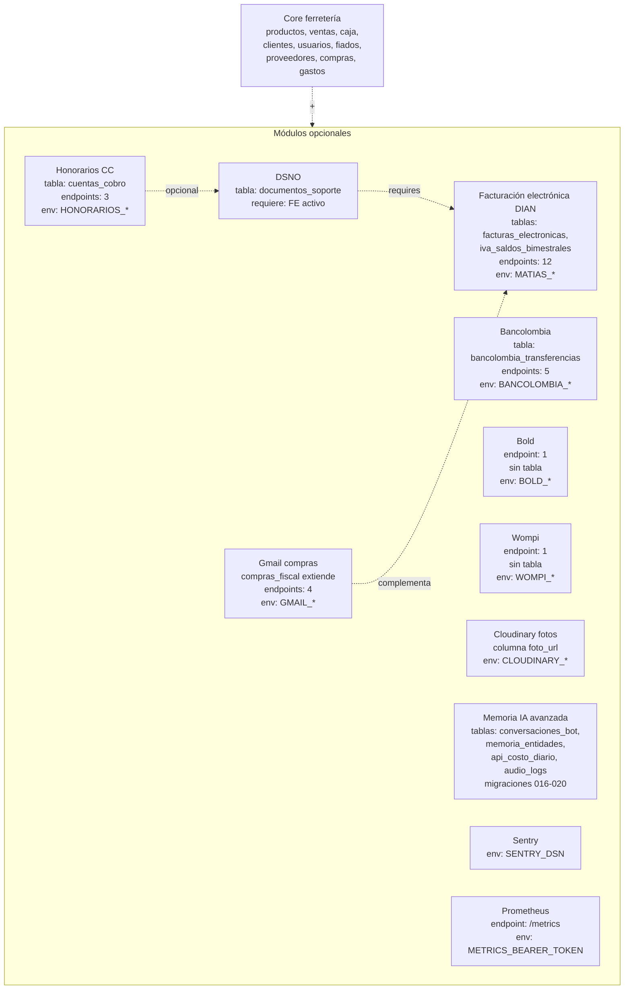

# 05 · Reutilizable vs específico de Punto Rojo

> Auditoría exhaustiva — Fase 5 de 8.
> Objetivo: catalogar qué del código actual se puede reutilizar tal cual, qué se parametriza por env/config y qué es específico de la relación con Punto Rojo o Colombia. Esto alimenta directamente Fase 6 (arquitectura del template) y Fase 7 (onboarding).

---

## 1. Matriz por dominio

| Dominio | Reutilizable tal cual | Parametrizable por env/config | Específico Punto Rojo | Específico Colombia |
|---|:-:|:-:|:-:|:-:|
| **Catálogo + Inventario** | ✅ | listado de plurales del bypass | — | — |
| **Ventas** (modelo + flujos + bypass) | ✅ | reglas de _ALIAS_FERRETERIA | — | — |
| **Caja + gastos** | ✅ | hora cierre safety net (21:00) | — | — |
| **Fiados (cuentas por cobrar)** | ✅ | — | — | — |
| **Proveedores (cuentas por pagar)** | ✅ | Cloudinary credentials | — | — |
| **Catálogo + mayorista (precio_por_cantidad)** | ✅ | — | — | — |
| **Fracciones (productos_fracciones)** | ✅ | — | — | — |
| **RBAC + auth (Telegram Login + JWT)** | ✅ (cuando se arregle el bug) | admin inicial | telegram_id 1831034712 | — |
| **Tiempo real (SSE + pg_notify)** | ✅ | — | — | — |
| **IA del bot (Claude + bypass + memorias 4 capas)** | ✅ | budget, modelos, aliases | — | — |
| **IA del dashboard (Chat Widget)** | ✅ | modelos, budget | — | — |
| **Reportes (kardex, resultados, proyección)** | ✅ | — | — | — |
| **Audio (Whisper transcription)** | ✅ | OPENAI_API_KEY | — | — |
| **Imágenes proveedores (Cloudinary)** | módulo opcional | credentials | — | — |
| **Facturación electrónica FE (MATIAS)** | módulo opcional | resolution, prefix, NIT | — | ✅ |
| **Notas crédito/débito DIAN** | módulo opcional | — | — | ✅ |
| **DS-NO (DSNO)** | módulo opcional | resolution_dsno, num_desde | datos Andrés en `_PROVEEDOR` dict | ✅ |
| **Honorarios (Cuenta de Cobro mensual)** | módulo opcional | HONORARIOS_VALOR, HONORARIOS_CHAT_ID | EMISOR/RECEPTOR hardcoded en `honorarios_service.py:31-44` | ✅ |
| **Libro IVA bimestral** | módulo opcional | — | — | ✅ |
| **Bancolombia (vía Gmail Pub/Sub)** | módulo opcional | OAuth credentials | — | ✅ |
| **Bold (webhook)** | módulo opcional | BOLD_WEBHOOK_SECRET | — | ✅ (CO/MX) |
| **Wompi (webhook)** | módulo opcional | WOMPI_EVENTS_SECRET | — | ✅ (CO) |
| **Gmail webhook (compras fiscales)** | módulo opcional | OAuth + PubSub topic | — | ✅ |
| **Sentry** | opcional | SENTRY_DSN | — | — |
| **Prometheus metrics** | ✅ | METRICS_BEARER_TOKEN | — | — |

**Conclusión**: ~70% reutilizable, ~20% parametrizable, ~10% específico Punto Rojo / Colombia.

---

## 2. Constantes hardcoded — lista exhaustiva a sacar a config

### 2.1. URLs y endpoints
| Constante | Archivo | Valor actual | Notas |
|---|---|---|---|
| URL Railway producción | `api.py:323`, `api.py:452`, `routers/auth.py:136` | `https://bot-ventas-ferreteria-production.up.railway.app` | C-05 |
| MATIAS API base | `services/facturacion_service.py:37` | `https://api-v2.matias-api.com/api/ubl2.1` | OK como default si la ferretería usa MATIAS |

### 2.2. Datos personales (proveedor de servicios / desarrollador)
| Constante | Archivo | Valor actual |
|---|---|---|
| EMISOR Cuenta de Cobro | `services/honorarios_service.py:31-38` | Andrés Felipe Malo Hernández, CC 1043295412, NIT 1043295412-4, dirección, ciudad Cartagena |
| RECEPTOR Cuenta de Cobro | `services/honorarios_service.py:40-44` | Ferretería Punto Rojo F.D, NIT 1235046119-1 |
| Concepto del servicio | `services/honorarios_service.py:46-50` | "Servicios de desarrollo de software… Ferretería Punto Rojo" |
| _PROVEEDOR DSNO | `services/documento_soporte_service.py:44-61` | Datos Andrés + ciudad Cartagena |
| Descripción servicio DSNO | `services/documento_soporte_service.py:63-67` | "SERVICIOS DE DESARROLLO… CONTRATO PSV-001-2026" |

### 2.3. Defaults Colombia / Cartagena
| Constante | Archivo | Valor actual |
|---|---|---|
| `clientes.pais_id` default | `migrations/011_clientes_campos_fe.py:31` | 45 (Colombia en MATIAS) |
| `clientes.regimen_fiscal` default | `migrations/011_clientes_campos_fe.py:38` | 2 (No Responsable IVA) |
| `clientes.ciudad_nombre` default | `migrations/011_clientes_campos_fe.py:45` | 'Cartagena' |
| `clientes.municipio_dian` default | `migrations/008_migrate_facturacion.py:48` | 149 (Cartagena DANE) |
| Zona horaria | `config.py:25` | `America/Bogota` |
| Moneda | implícita | COP (montos como int sin decimales) |

### 2.4. Seeds de usuarios
| Constante | Archivo | Valor actual |
|---|---|---|
| Admin inicial | `migrations/004_usuarios_auth.py:57-63` | telegram_id 1831034712, "Andrés", admin |
| Vendedores placeholder | `migrations/004_usuarios_auth.py:59-62` | "Farid M", "Farid D", "Karolay", "Papá" — todos vendedores con telegram_id 1,2,3,4 |

### 2.5. Reglas de bypass y prompt
| Constante | Archivo | Comentario |
|---|---|---|
| Plurales de productos | `bypass.py:133-139` | tornillo, puntilla, chazo, plastico — ajustable por ferretería |
| `_ALIAS_FERRETERIA` regex | `ai/prompts.py:93-130+` | lija $→#, drywall 6x3, rodillo convencional, pita carpa azul |
| Lista exclusión top de productos | `routers/ventas.py:36-41` | "venta varia", "ventas varia", "excedente de caja" — esto es bastante genérico, OK |

### 2.6. Otras constantes operativas
| Constante | Archivo | Valor actual |
|---|---|---|
| Hora safety net histórico | `start-bot.py:80` | 21:00 (cierre típico de la ferretería) |
| Hora compresor nocturno | `start-bot.py:159` | 3:00 AM |
| Día generación CC mensual | `start-bot.py:258` | día 23, 9:00 AM |
| Cap historiales bot | `ventas_state.py` | varios constants |
| Cap standby | `ventas_state.py` | varios constants |
| Watch Gmail renovación | `start-bot.py` + `api.py` | cada 6 días |
| Rate limit bot | `middleware/auth.py:56-57` | 5 mensajes / 2 segundos |
| Rate limit mensajes | `handlers/mensajes.py:74-75` | 18 mensajes / 60 segundos |
| TTL cache de precios | `ai/price_cache.py` | 300 s |
| Cache TTL Anthropic prompt | `config.py:75-81` | 1 h (extended) |

---

## 3. Tablas de la BD — clasificación

### 3.1. Core ferretería (reusables tal cual)
- `productos`, `productos_fracciones`, `inventario`
- `clientes` (sin campos FE)
- `usuarios`
- `ventas`, `ventas_detalle`
- `caja`, `gastos`, `historico_ventas`
- `compras` (sin IVA si la ferretería no es responsable)
- `facturas_proveedores`, `facturas_abonos`
- `fiados`
- `config` o `ferrebot_config` (consolidar a una)

### 3.2. Módulos opcionales

**Facturación DIAN**:
- `facturas_electronicas` (FE + notas)
- `iva_saldos_bimestrales`
- `compras_fiscal` (con IVA + eventos RADIAN)
- columnas FE en `ventas`, `clientes`, `productos`

**Pagos integrados**:
- `bancolombia_transferencias` (sólo si usa Bancolombia + Gmail)

**Honorarios / DSNO**:
- `cuentas_cobro`, `documentos_soporte`

**IA avanzada**:
- `conversaciones_bot` (memoria de chat)
- `memoria_entidades` (notas Capa 4)
- `audio_logs`
- `api_costo_diario` (budget tracking)

> Para una ferretería con un setup mínimo (sin FE, sin pagos integrados), las tablas obligatorias se reducen a las 12-13 del 3.1 plus `audio_logs` si quieren el bot por voz.

---

## 4. Variables de entorno — clasificación

### 4.1. Núcleo obligatorio (siempre)
- `TELEGRAM_TOKEN`, `ANTHROPIC_API_KEY`, `OPENAI_API_KEY`, `DATABASE_URL`, `SECRET_KEY`, `WEBHOOK_URL`, `SERVICE_TYPE`, `PORT`, `CORS_ORIGIN`.

### 4.2. Branding y datos del negocio
- (Nuevas) `EMPRESA_NOMBRE`, `EMPRESA_NIT`, `EMPRESA_CIUDAD`, `EMPRESA_DIRECCION`, `EMPRESA_TELEFONO`.
- (Existente, sólo si se usa MATIAS) `MATIAS_PREFIX`, `MATIAS_RESOLUTION`, `MATIAS_NUM_DESDE`.

### 4.3. Admin inicial
- (Nuevas) `ADMIN_TELEGRAM_ID`, `ADMIN_NOMBRE`.

### 4.4. Módulo facturación electrónica DIAN (opcional)
- `MATIAS_EMAIL`, `MATIAS_PASSWORD`, `MATIAS_RESOLUTION`, `MATIAS_PREFIX`, `MATIAS_NUM_DESDE`, `MATIAS_API_URL`, `MATIAS_AMBIENTE`, `MATIAS_WEBHOOK_SECRET`.

### 4.5. Módulo DSNO (opcional, requiere FE)
- `MATIAS_RESOLUTION_DSNO`, `MATIAS_DS_NUM_DESDE`.

### 4.6. Módulo honorarios (opcional)
- `HONORARIOS_HABILITADO=true/false` (nueva, controla activación).
- `HONORARIOS_VALOR`, `HONORARIOS_CHAT_ID`.
- (Nuevas) `HONORARIOS_PROVEEDOR_NOMBRE`, `HONORARIOS_PROVEEDOR_CC`, `HONORARIOS_PROVEEDOR_NIT`, `HONORARIOS_PROVEEDOR_DIRECCION`, `HONORARIOS_PROVEEDOR_EMAIL`, `HONORARIOS_PROVEEDOR_MOBILE`.

### 4.7. Módulo Cloudinary (opcional)
- `CLOUDINARY_CLOUD_NAME`, `CLOUDINARY_API_KEY`, `CLOUDINARY_API_SECRET`.

### 4.8. Módulo Bancolombia (opcional)
- `BANCOLOMBIA_GMAIL_CLIENT_ID`, `BANCOLOMBIA_GMAIL_CLIENT_SECRET`, `BANCOLOMBIA_GMAIL_REFRESH_TOKEN`, `BANCOLOMBIA_PUBSUB_TOPIC`, `BANCOLOMBIA_GMAIL_USER`, `BANCOLOMBIA_PUBSUB_TOKEN`.

### 4.9. Módulo Gmail compras (opcional)
- `GMAIL_CLIENT_ID`, `GMAIL_CLIENT_SECRET`, `GMAIL_REFRESH_TOKEN`, `GMAIL_PUBSUB_TOPIC`, `GMAIL_USER`, `PUBSUB_TOKEN`.

### 4.10. Módulo Bold (opcional)
- `BOLD_WEBHOOK_SECRET`.

### 4.11. Módulo Wompi (opcional)
- `WOMPI_EVENTS_SECRET`.

### 4.12. Observabilidad (opcional)
- `SENTRY_DSN`, `SENTRY_ALERT_CHAT_ID`, `METRICS_BEARER_TOKEN`.

### 4.13. Telegram notificaciones (opcional)
- `TELEGRAM_NOTIFY_CHAT_ID`, `AUTHORIZED_CHAT_IDS`, `RATE_LIMIT_SEGUNDOS`, `RATE_LIMIT_MAX`.

### 4.14. Tuning IA (opcional)
- `BUDGET_SONNET_DIARIO`, `BUDGET_HAIKU_DIARIO`, `MODO_MATCH_ONLY`, `CARRITO_TIMEOUT_SEG`.

**Total**: ~22 obligatorias, ~30 opcionales según módulos activados.

---

## 5. Mapa: módulo → tabla → endpoints → env vars

Esto es lo que cada módulo opcional "agrega" al sistema cuando se activa:

---

## 6. Lo que hay que tocar al clonar para una nueva ferretería (estado actual)

> **Antes** de refactorizar el repo a template-base. Esto es el costo de clonar con el código actual:

1. **CORS** — editar 3 archivos:
   - `api.py:323` allow_origins
   - `api.py:452` _CORS_ORIGIN
   - `routers/auth.py:136` Access-Control-Allow-Origin

2. **Migraciones** — editar 1 archivo:
   - `migrations/004_usuarios_auth.py:57-63` para cambiar el admin inicial.

3. **Datos de honorarios** (si se activa) — editar 2 archivos:
   - `services/honorarios_service.py:31-50` (EMISOR + RECEPTOR + CONCEPTO_DEFAULT).
   - `services/documento_soporte_service.py:44-67` (_PROVEEDOR + _DESCRIPCION_SERVICIO).

4. **Datos de la ferretería en facturas/notas/PDFs**: revisar todos los PDFs generados — los datos de RECEPTOR / EMPRESA suelen estar hardcoded en plantillas. Hay que buscarlos en `services/honorarios_service.py` (_generar_pdf), generación de facturas, etc.

5. **Bypass** — opcional, edición de `bypass.py:133-139` para plurales/categorías.

6. **Aliases ferretería** — opcional, edición de `ai/prompts.py:93+` (_ALIAS_FERRETERIA) para reglas específicas.

7. **Variables de entorno** — crear las ~22 obligatorias en Railway de la nueva ferretería.

8. **DNS / URLs** — apuntar dominio del dashboard si tiene custom; pegar URL final en `CORS_ORIGIN`.

9. **Telegram** — crear nuevo bot con BotFather, capturar TOKEN, registrar webhook.

10. **MATIAS** (si aplica) — crear cuenta MATIAS para la nueva ferretería con su NIT, obtener resolution + prefix + num_desde, configurar resolución DSNO si aplica.

11. **Gmail OAuth** (si aplica) — crear proyecto GCP, habilitar Pub/Sub, configurar OAuth, generar refresh tokens (script `generate_bancolombia_token.py`).

12. **Cloudinary** (si aplica) — crear cuenta para fotos.

13. **Sentry** (si aplica) — crear proyecto, configurar DSN, webhook a Telegram.

14. **Seeds de catálogo** — la ferretería nueva probablemente tendrá sus propios productos. Importar con script (no documentado actualmente — usar tabla `productos` directamente).

15. **Dashboard branding** — logo, color primario, nombre, favicon en `dashboard/src/` (revisar `AnimatedBackground.jsx` color #C8200E, copy de pie de página, etc.).

**Tiempo estimado clonar manualmente con el código actual**: **3-4 días persona** con muchos puntos manuales. Sin template-base, cada cliente requiere casi una semana de setup.

---

## 7. Lo que cambiaría con un template-base bien hecho

| Tarea | Hoy (manual) | Con template-base |
|---|---|---|
| CORS | editar 3 archivos | 1 env var |
| Admin inicial | editar migración | 2 env vars |
| Datos honorarios | editar 2 archivos | 6 env vars (si se activa) |
| Branding dashboard | editar src React | 3-4 env vars + 1 logo file |
| Activar/desactivar módulos | hardcoded en imports | env flags |
| Migraciones | correr 30 manuales | un solo `python migrate.py` |
| Seeds | sin script | `python seed.py --from=clientes.xlsx` |
| **Total tiempo clonar** | **3-4 días** | **2-3 horas** |

Detalle del rediseño en Fase 6.

---

**Siguiente paso**: Fase 6 — propuesta de arquitectura del template-base.
