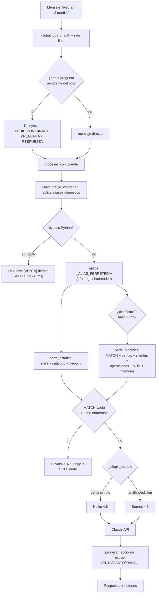

# 10 · Auditoría del chatbot — orden y precisión

> Auditoría exhaustiva — análisis del motor conversacional del bot.
> Motivado por un bug reportado en producción: el usuario escribió "Hola" y
> el bot intentó registrar una venta de cerraduras de un turno anterior.
> Objetivo: entender por qué el bot "no es muy ordenado ni preciso" comparado
> con chatbots modernos, e identificar mejoras concretas.

---

## 1. Cómo procesa un mensaje el bot (flujo real)



**Observación clave**: hay **4 capas de heurística Python ANTES de Claude** (bypass, alias, multi-turno, bloqueo match-vacío). Cada capa intenta "adivinar" la intención. Esto es justamente lo que lo hace **menos predecible** que un chatbot moderno — la decisión está repartida en muchos lugares y cada heurística puede equivocarse de forma independiente (como el bug "Hola").

---

## 2. Anatomía del system prompt

El prompt se arma en bloques. Orden actual:

```
┌─ parte_estatica (cacheable 1h) ──────────────────┐
│ 1. skills estáticos (core.md + precios_base.md)  │  ~14k chars
│ 2. INFORMACION DEL NEGOCIO (json)                │
│ 3. CATALOGO (632 productos: nombre:precio)       │  ~600 líneas
│ 4. _DOC_BUSCAR_HISTORICO (cómo usar tag)         │
│ 5. _DOC_BUSCAR_MEMORIA (cómo usar tag)           │
└──────────────────────────────────────────────────┘
┌─ parte_dinamica (sin caché, por mensaje) ────────┐
│ 6. MATCH (candidatos del catálogo para el msg)   │  ~300 líneas
│ 7. precálculos especiales (fracciones, tornillos)│
│ 8. sección ventas (resumen del día)              │
│ 9. sección clientes                              │
│ 10. sección operaciones (caja/inventario)        │
│ 11. skills dinámicos (pinturas, tornillos, etc)  │
│ 12. contexto turno                               │
│ 13. memoria entidades (notas Capa 4)             │
└──────────────────────────────────────────────────┘
┌─ contexto_extra (dashboard) ─────────────────────┐
│ 14. catálogo completo + estado del negocio       │
└──────────────────────────────────────────────────┘
```

**Lo que está BIEN**:
- ✅ Prompt caching con TTL 1h — el catálogo (lo más pesado) se cachea, ahorra ~60% de costo.
- ✅ Separación estático/dinámico bien pensada para el cache.
- ✅ Historial adaptativo (1-4 turnos según el tipo de mensaje).

**Lo que genera DESORDEN**:
- ⚠️ **13 secciones dinámicas concatenadas** — el prompt es enorme y heterogéneo. Claude recibe MATCH + ventas + clientes + operaciones + 7 skills + memoria en cada mensaje, aunque el usuario solo dijo "2 martillo".
- ⚠️ **Reglas dispersas en `core.md`** (177 líneas, 15+ secciones con MAYÚSCULAS gritando "REGLA CRÍTICA"). Cuando todo es crítico, nada lo es — Claude pierde jerarquía.
- ⚠️ **Catálogo cortado a 60 ítems por categoría** (`items[:60]` en `_construir_parte_estatica:203`). Si una categoría tiene >60 productos, los demás **no aparecen en el prompt** y solo se rescatan vía MATCH. Riesgo de "no encontré" falsos.

---

## 3. Problemas de PRECISIÓN identificados

### P-01 (CRÍTICO, ya fixado) · Heurística multi-turno demasiado laxa
Era el bug "Hola → cerraduras". Resuelto en V-11 con 3 guards. Pero es síntoma de un problema más profundo: **demasiada lógica de adivinanza de contexto en Python** en vez de dejar que Claude maneje el contexto con el historial.

### P-02 (ALTO) · Contexto compartido entre vendedores en grupo
El bot vive en un **grupo Telegram con múltiples vendedores** (Andrés, Farid, Karolay, Patricia). Todos comparten el mismo `chat_id` → el mismo `historial`. Cuando Karolay escribe e inmediatamente Andrés escribe, el historial mezcla a ambos.

- El prefijo `"{vendedor}: "` ayuda a Claude a distinguir, pero la heurística multi-turno (P-01) NO respetaba ese prefijo.
- **Riesgo de fondo**: una venta de un vendedor puede "contaminar" el contexto de otro.

**Mejora propuesta**: el historial debería poder filtrarse por `vendedor` cuando se detecta cambio de hablante, o al menos las heurísticas Python deben respetar el cambio de vendedor.

### P-03 (ALTO) · 46% de ventas sin producto_id (de validación empírica)
El MATCH no resuelve el producto contra el catálogo en casi la mitad de las ventas. Causas probables:
- El catálogo cortado a 60/categoría.
- Productos duplicados ("Laca Catalizada Beis/Beige/Beige Catalizada").
- Fuzzy match que falla con typos no cubiertos por aliases.

**Mejora propuesta**: cuando Claude registra una venta, el `producto_id` debería resolverse en el momento del INSERT (no quedar NULL). Si no hay match exacto, guardar el más cercano + flag de revisión.

### P-04 (MEDIO) · Aliases hardcoded gigantes
`_ALIAS_FERRETERIA` en `ai/prompts.py` tiene **40+ reglas regex hardcoded** específicas de Punto Rojo:
- "lija $60 → lija #60"
- "botella de thinner → thinner 4000"
- "pita → pita carpa azul"
- "pagaternit → pegaternit"
- etc.

Cada ferretería nueva tendría reglas distintas. Hoy están enterradas en código. Esto las hace frágiles (orden importa, se pisan entre sí) y no escalables.

**Mejora propuesta**: mover a tabla `aliases` (que ya existe pero solo tiene 1 fila) o a un archivo de config por ferretería.

### P-05 (MEDIO) · Bypass + Claude pueden discrepar
El bypass Python y Claude usan **lógicas de precio independientes**. Para el mismo mensaje, podrían dar resultados distintos si las reglas divergen. No hay un test que garantice paridad bypass↔Claude.

### P-06 (MEDIO) · El "BLOQUEO MATCH-VACÍO" puede ser agresivo
`ai/__init__.py:478` — si el MATCH está vacío y el mensaje tiene números, el bot responde "No tengo X en el catálogo" **sin consultar a Claude**. Pero si el producto SÍ existe con otro nombre, el vendedor recibe un "no tengo" falso. Choca con P-03 (46% sin match).

---

## 4. Problemas de ORDEN / claridad

### O-01 · La lógica de intención está repartida en 5+ lugares
| Decisión | Dónde vive |
|---|---|
| ¿Es bypass? | `bypass.py` (3 listas de palabras + regex) |
| ¿Es clarificación multi-turno? | `ai/__init__.py:387` (heurística) |
| ¿Es consulta vs venta? | `ai/__init__.py:463` (`_kw_no_venta`) |
| ¿Venta varia? | `ai/__init__.py:469` (`_kw_venta_varia`) |
| ¿Qué modelo usar? | `ai/prompts.py:_elegir_modelo` (2 listas) |
| ¿Cuánto historial? | `ai/prompts.py:_calcular_historial` |
| ¿Es venta o conversación? | `core.md` (regla en el prompt) |

**Siete clasificadores de intención distintos**, algunos en Python, otros en el prompt. Se solapan y a veces se contradicen. Un chatbot moderno tiene **un solo punto de decisión**: el modelo, con tools/function-calling.

### O-02 · `core.md` mezcla identidad, reglas de negocio y formato de salida
177 líneas con 15+ secciones. Reglas de IVA, cuñetes, venta varia, formato JSON, todo junto. Difícil de mantener y Claude tiene que procesarlo entero en cada mensaje.

### O-03 · No usa tool-calling / structured output nativo
El bot pide a Claude que emita `[VENTA]{...}[/VENTA]` como texto, y luego parsea con regex en `procesar_acciones`. La API de Claude soporta **tool use** (function calling) que garantiza JSON válido y elimina el parsing frágil. Esto es probablemente **la mejora más grande disponible**.

### O-04 · El prompt es enorme aún para mensajes triviales
Para "2 martillo" (que ni siquiera llega a Claude por el bypass), si llegara, recibiría las 13 secciones dinámicas. No hay "modo ligero" del prompt para ventas simples que sí pasan a Claude.

---

## 5. Comparación con chatbots modernos

| Aspecto | FerreBot actual | Estándar moderno (Claude/GPT apps) |
|---|---|---|
| Decisión de intención | 7 clasificadores Python + prompt | 1 modelo con tool-calling |
| Salida estructurada | Tags de texto + regex parsing | Tool use (JSON garantizado) |
| Contexto multi-turno | Heurísticas Python frágiles | Historial nativo + el modelo decide |
| Reglas de negocio | 177 líneas en core.md | Tools con schemas + descripciones concisas |
| Manejo de ambigüedad | Reglas explícitas "pregunta si..." | El modelo pregunta naturalmente |
| Aliases/normalización | 40+ regex hardcoded | Embeddings / búsqueda semántica |
| Multi-usuario | chat_id compartido, prefijo string | Sesiones por usuario |

**El bot funciona** (90% FE exitosa, ventas consistentes), pero su arquitectura es de **"capas de heurística defensiva"** en vez de **"confiar en el modelo con herramientas bien definidas"**. Eso explica la sensación de desorden: cada heurística es un parche, y los parches a veces chocan.

---

## 6. Mejoras propuestas (ordenadas por impacto/esfuerzo)

### Quick wins (alto impacto, bajo esfuerzo)

**M-01 · Migrar a tool-calling de Claude** ⭐ (la más importante)
Reemplazar el patrón `[VENTA]{...}[/VENTA]` + regex por **tool use** nativo:
```python
tools = [{
    "name": "registrar_venta",
    "description": "Registra una o más ventas de productos",
    "input_schema": {
        "type": "object",
        "properties": {
            "ventas": {"type": "array", "items": {...}}
        }
    }
}]
```
Beneficios: JSON siempre válido, elimina ~200 líneas de parsing regex en `procesar_acciones`, Claude decide cuándo registrar vs preguntar de forma nativa. Esfuerzo: 2-3 días. **Es la mejora que más "ordena" el bot.**

**M-02 · Reducir las heurísticas Python pre-Claude**
Quitar la heurística multi-turno (P-01) y el bloqueo match-vacío (P-06) — dejar que Claude maneje el contexto con el historial. Mantener solo el bypass (que es valioso por costo). Esfuerzo: 1 día + testing.

**M-03 · Resolver producto_id al registrar** (cierra P-03)
Cuando se registra una venta, buscar el `producto_id` con fuzzy match y guardarlo. Si no hay match >0.8 de confianza, marcar para revisión en vez de NULL. Esfuerzo: 4h.

### Mejoras medianas

**M-04 · Consolidar reglas de `core.md`**
Separar en: identidad (5 líneas), formato de salida (al usar tools, casi desaparece), y reglas de negocio (movidas a descripciones de tools). Esfuerzo: 1 día.

**M-05 · Sesiones por vendedor en grupo** (cierra P-02)
Cuando el historial detecta cambio de vendedor, no mezclar contexto de ventas en curso. Esfuerzo: 1 día.

**M-06 · Aliases a tabla/config** (cierra P-04, alinea con template-base)
Mover `_ALIAS_FERRETERIA` a la tabla `aliases` (ya existe). Esfuerzo: 1 día.

### Mejoras grandes (para el template-base / v2)

**M-07 · Búsqueda semántica de productos**
Reemplazar fuzzy_match + 40 regex por embeddings del catálogo. Resuelve P-03, P-04 de raíz. Esfuerzo: 1 semana.

**M-08 · Catálogo completo sin corte de 60**
Con tool-calling y un catálogo bien indexado, no hace falta meter todo el catálogo en el prompt. Claude pide los productos que necesita vía tool. Esfuerzo: depende de M-01.

---

## 7. Recomendación

**Para "ordenar y dar precisión" al bot, la jugada de mayor impacto es M-01 (tool-calling)**. Hoy el bot pide a Claude que escriba tags de texto y luego los parsea con regex frágil — eso es pre-2024. Con tool use:
- El JSON siempre es válido (cero errores de parsing).
- Claude decide registrar/preguntar de forma nativa, sin las 7 capas de heurística.
- Se eliminan ~200 líneas de `procesar_acciones` + las heurísticas multi-turno y bloqueo.
- El prompt se vuelve mucho más corto y claro.

**Plan sugerido de "modernización del bot" (v2 del motor IA)**:
1. M-01 tool-calling (2-3 días) — la base.
2. M-02 quitar heurísticas redundantes (1 día) — depende de M-01.
3. M-03 resolver producto_id (4h).
4. M-06 aliases a config (1 día) — alinea con template-base.

Total: ~1 semana para un bot notablemente más ordenado y preciso.

**Lo que NO recomiendo tocar**:
- El bypass Python — es un activo de costo (60% de mensajes sin Claude). Mantenerlo.
- El prompt caching — está bien implementado.
- El budget tracking — funciona.

---

## 8. Conexión con el resto de la auditoría

- Estas mejoras del bot encajan en un **"Sprint 5 — Modernización del motor IA"**, después del template-base.
- M-06 (aliases a config) y M-01 (tool-calling) **deberían hacerse durante el template-base** porque definen cómo se parametriza el bot por ferretería.
- El bug V-11 ya está fixado como parche; M-02 lo resolvería de raíz al quitar la heurística.
